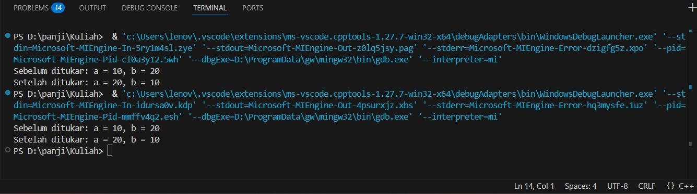
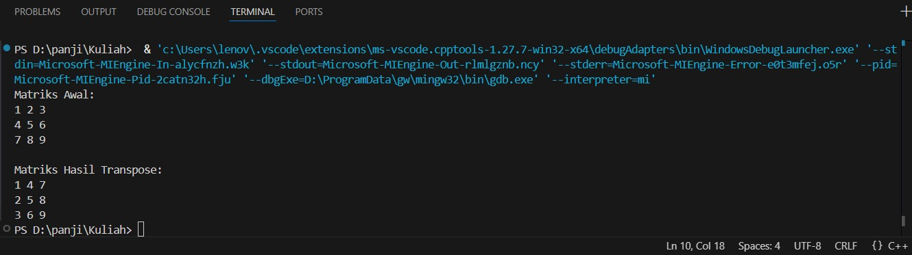

 # <h1 align="center">Laporan Praktikum Modul 2 <br> Pengenalan C++</h1>
<p align="center">PANJI FAUZAN HABIBULLAH GALANG SOKYA WHIJAYA - 103112430162</p>

## Dasar Teori

Struktur data digunakan untuk menyimpan dan mengatur data agar mudah diakses dan dikelola. Salah satu contohnya adalah **array**, yang memungkinkan penyimpanan beberapa nilai dalam satu variabel dengan tipe data yang sama. Array dideklarasikan dengan menentukan tipe data, nama array, serta jumlah elemen yang akan disimpan.

Selain array, C++ juga memiliki **pointer**, yaitu variabel khusus yang menyimpan alamat memori dari variabel lain, bukan nilainya langsung. Pointer memungkinkan program mengakses dan memanipulasi data di memori secara efisien, sehingga sangat penting untuk pemrograman tingkat sistem dan manajemen memori dinamis.

## Guided

### soal 1
07_call_by_pointer.cpp

```go
#include <iostream>
using namespace std;

int main()
{
    int a = 10, b = 20;
    cout << "Sebelum ditukar: a = " << a << ", b = " << b << endl;
    tukar(&a, &b);
    cout << "Setelah ditukar: a = " << a << ", b = " << b << endl;
    return 0;
}

void tukar(int *px, int *py)
{
    int temp = *px;
    *px = *py;
    *py = temp;
}
```

> Output
> 

Program ini digunakan untuk menukar nilai dua variabel (a dan b) menggunakan pointer. Program ini menunjukkan cara kerja pointer dalam fungsi untuk mengubah nilai variabel di luar fungsi. Tanpa pointer, nilai variabel a dan b di fungsi main tidak akan berubah karena C++ menggunakan pass-by-value secara default.

### soal 2
08_call_by_reference.cpp

```go
#include <iostream>
using namespace std;

void tukar(int &x, int &y); 

int main()
{
    int a = 10, b = 20;
    cout << "Sebelum ditukar: a = " << a << ", b = " << b << endl;
    tukar(a, b);
    cout << "Setelah ditukar: a = " << a << ", b = " << b << endl;
    return 0;
}

void tukar(int &x, int &y)
{
    int temp = x;
    x = y;
    y = temp;
}
```

> Output
> 

Program ini digunakan untuk menukar nilai dua variabel (a dan b) menggunakan referensi (reference). Program ini menggunakan pass by reference agar fungsi dapat mengubah nilai variabel asli tanpa pointer.

## Unguided

### Soal 1

1. Buatlah sebuah program untuk melakukan transpose pada sebuah matriks persegi berukuran 3x3. Operasi transpose adalah mengubah baris menjadi kolom dan sebaliknya. Inisialisasi matriks awal di dalam kode, kemudian buat logika untuk melakukan transpose dan simpan hasilnya ke dalam matriks baru. Terakhir, tampilkan matriks awal dan matriks hasil transpose.

```go
#include <iostream>
using namespace std;

int main()
{

    int matriks[3][3] = {
        {1, 2, 3},
        {4, 5, 6},
        {7, 8, 9}
    };

    int transpose[3][3]; 

    for (int i = 0; i < 3; i++)
    {
        for (int j = 0; j < 3; j++)
        {
            transpose[j][i] = matriks[i][j];
        }
    }

    cout << "Matriks Awal:\n";
    for (int i = 0; i < 3; i++)
    {
        for (int j = 0; j < 3; j++)
        {
            cout << matriks[i][j] << " ";
        }
        cout << endl;
    }

    cout << "\nMatriks Hasil Transpose:\n";
    for (int i = 0; i < 3; i++)
    {
        for (int j = 0; j < 3; j++)
        {
            cout << transpose[i][j] << " ";
        }
        cout << endl;
    }

    return 0;
}
```

> Output
> 

Program ini digunakan untuk melakukan transpose pada matriks 3x3. Transpose berarti baris menjadi kolom dan kolom menjadi baris. Proses transpose dilakukan dengan menukar indeks baris dan kolom ([i][j] → [j][i]).

### Soal 2

Buatlah program yang menunjukkan penggunaan call by reference. Buat sebuah prosedur bernama kuadratkan yang menerima satu parameter integer secara referensi (&). Prosedur ini akan mengubah nilai asli variabel yang dilewatkan dengan nilai kuadratnya. Tampilkan nilai variabel di main() sebelum dan sesudah memanggil prosedur untuk membuktikan perubahannya.

```go
#include <iostream>
using namespace std;

void kuadratkan(int &x) {
    x = x * x;
}

int main() {
    int angka; 

    cout << "Nilai awal: ";
    cin>>angka;
    kuadratkan(angka);
    cout << "Nilai setelah dikuadratkan: " << angka << endl;

    return 0;
}
```

> Output
> 

Program ini menunjukkan penggunaan call by reference, di mana fungsi kuadratkan() menerima variabel secara referensi (&), sehingga perubahan di dalam fungsi langsung mempengaruhi variabel asli di main().

## Referensi

1. https://en.wikipedia.org/wiki/Data_structure (diakses blablabla)
2. https://learn.microsoft.com/id-id/cpp/cpp/void-cpp?view=msvc-170
3. https://www.duniailkom.com/tutorial-belajar-c-plus-plus-tipe-data-float-dan-double-bahasa-c-plus-plus/
