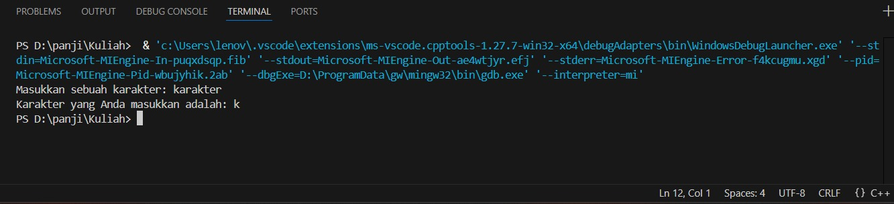
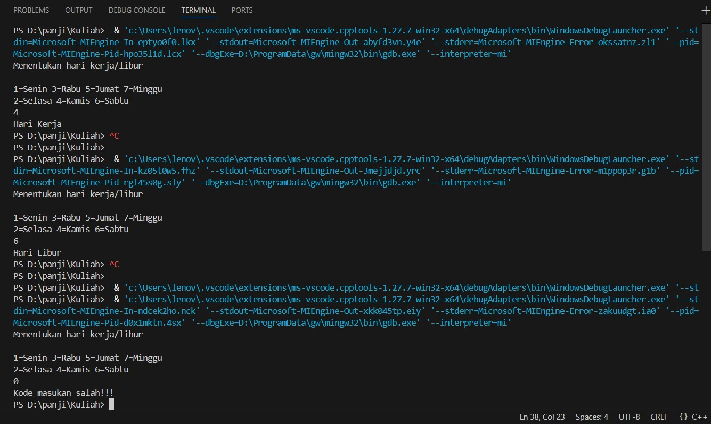
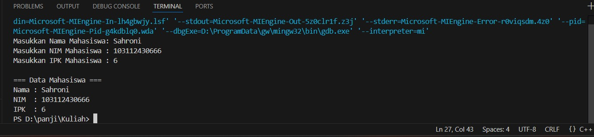
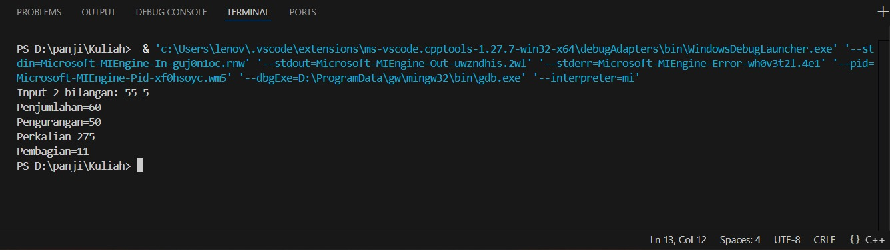
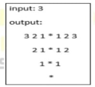

 # <h1 align="center">Laporan Praktikum Modul 2 <br> Pengenalan C++</h1>
<p align="center">PANJI FAUZAN HABIBULLAH GALANG SOKYA WHIJAYA - 103112430162</p>

## Dasar Teori

Array adalah kumpulan data sejenis yang disimpan berurutan di memori dan diakses dengan indeks.
Pointer adalah variabel yang menyimpan alamat memori dari variabel lain.
Nama array sebenarnya adalah pointer ke elemen pertama array, sehingga keduanya saling berkaitan dalam pengaksesan data di memori.

## Guided

### soal 1
TEST.cpp

```go
#include <iostream>
using namespace std;
int main()
{
    string ch;
    cout << "Masukkan sebuah karakter: ";
    // cin >> ch;
    ch = getchar();  //Menggunakan getchar() untuk membaca satu karakter
    cout << "Karakter yang Anda masukkan adalah: " << ch << endl;
    return 0;
}
```

> Output
> 

Program ini akan mengambil huruf awal/char awal dari char-char yang diinput dengan menggunakan getchar()

### soal 2
aritmatika.cpp

```go
#include <iostream>
using namespace std;
int main()
{
    int W, X, Y;
    float Z;
    X = 7;
    Y = 3;
    W = 1;
    Z = (X + Y) / (Y + W);
    cout << "Nilai z = " << Z << endl;
    return 0;
}
```

> Output
> 

Program ini digunakan untuk mencari hasil aritmatika dari Z = (7+3)/(3+1). Z dideklarasikan menggunakan float dikarenakan hasil pembagian mempunyai kemungkinan desimal

### soal 3
perulangan.cpp

```go
#include <iostream>
using namespace std;
// int main()
// {
//     int jum;
//     cout << "jumlah perulangan: ";
//     cin >> jum;
//     for (int i = 0; i < jum; i++)
//     {
//         cout << "saya sahroni\n";
//     }
//     return 1;
// }


// while
int main()
{
    int i = 0;
    int jum;
    cin >> jum;
    do
    {
        cout << "bahlil ke-" << (i + 1) << endl;
        i++;
    } while (i < jum);
    return 0;
}
```

> Output
> 

Ini adalah program perulangan do while. Program ini akan mengulang kalimat "bahlil ke-[n]" sebanyak n(angka yang anda input).

### soal 4
kondisi.cpp

```go
#include <iostream>
using namespace std;
// int main()
// {
//     double tot_pembelian, diskon;
//     cout << "total pembelian: Rp";
//     cin >> tot_pembelian;
//     diskon = 0;
//     if (tot_pembelian >= 100000)
//         diskon = 0.05 * tot_pembelian;
//     cout << "besar diskon = Rp" << diskon;
// }


// int main()
// {
//     double tot_pembelian, diskon;
//     cout << "total pembelian: Rp";
//     cin >> tot_pembelian;
//     diskon = 0;
//     if (tot_pembelian >= 100000)
//         diskon = 0.05 * tot_pembelian;
//     else
//         diskon = 0;
//     cout << "besar diskon = Rp" << diskon;
// }


int main()
{
    int kode_hari;
    cout << "Menentukan hari kerja/libur\n"<<endl;
    cout << "1=Senin 3=Rabu 5=Jumat 7=Minggu "<<endl;
    cout << "2=Selasa 4=Kamis 6=Sabtu "<<endl;
    cin >> kode_hari;
    switch (kode_hari)
    {
    case 1:
    case 2:
    case 3:
    case 4:
    case 5:
        cout<<"Hari Kerja";
        break;
    case 6:
    case 7:
        cout<<"Hari Libur";
        break;
    default:
        cout<<"Kode masukan salah!!!";
    }
    return 0;
}
```

> Output
> 

Program ini digunakan untuk mencari tahu apakah hari yang diinput adalah hari kerja atau libur. Program ini menggunakan switch case

### soal 5
struct.cpp

```go
#include <iostream>
#include <string>
using namespace std;

// Definisi struct
struct Mahasiswa {
    string nama;
    string nim;
    float ipk;
};

int main() {

    Mahasiswa mhs1;

    cout << "Masukkan Nama Mahasiswa: ";
    getline(cin, mhs1.nama);
    // cin >> mhs1.nama;
    cout << "Masukkan NIM Mahasiswa : ";
    cin >> mhs1.nim;
    cout << "Masukkan IPK Mahasiswa : ";
    cin >> mhs1.ipk;

    cout << "\n=== Data Mahasiswa ===" << endl;
    cout << "Nama : " << mhs1.nama << endl;
    cout << "NIM  : " << mhs1.nim << endl;
    cout << "IPK  : " << mhs1.ipk << endl;

    return 0;
}
```

> Output
> 

Program ini menggunakan struct dan getline. Struct bisa menyimpan beberapa variabel dalam satu kesatuan dan getline digunakan agar kodenya dapat membaca satu baris penuh untuk nama (supaya bisa menerima spasi).

### soal 6
fungsi.cpp

```go
#include <iostream>
using namespace std;

// Prosedur: hanya menampilkan hasil, tidak mengembalikan nilai
void tampilkanHasil(double p, double l)
{
    cout << "\n=== Hasil Perhitungan ===" << endl;
    cout << "Panjang : " << p << endl;
    cout << "Lebar   : " << l << endl;
    cout << "Luas    : " << p * l << endl;
    cout << "Keliling: " << 2 * (p + l) << endl;
}

// Fungsi: mengembalikan nilai luas
double hitungLuas(double p, double l)
{
    return p * l;
}

// Fungsi: mengembalikan nilai keliling
double hitungKeliling(double p, double l)
{
    return 2 * (p + l);
}

int main()
{
    double panjang, lebar;

    cout << "Masukkan panjang: ";
    cin >> panjang;
    cout << "Masukkan lebar  : ";
    cin >> lebar;

    // Panggil fungsi
    double luas = hitungLuas(panjang, lebar);
    double keliling = hitungKeliling(panjang, lebar);

    cout << "\nDihitung dengan fungsi:" << endl;
    cout << "Luas      = " << luas << endl;
    cout << "Keliling  = " << keliling << endl;

    // Panggil prosedur
    tampilkanHasil(panjang, lebar);

    return 0;
}
```

> Output
> 

Program ini menghitung luas & keliling dengan fungsi dan prosedur. Di program ini ada 2 hal yang mungkin asing bagi anda, yaitu void dan double. Saat digunakan sebagai jenis pengembalian fungsi, void kata kunci menentukan bahwa fungsi tidak mengembalikan nilai sedangkan tipe double mengembalikan nilai berupa bilangan desimal. 

## Unguided

### Soal 1

Buatlah program yang menerima input-an dua buah bilangan betipe float, kemudian memberikan output-an hasil penjumlahan, pengurangan, perkalian, dan pembagian dari dua bilangan tersebut.

```go
#include <iostream>
using namespace std;

int main()
{
    double a,b,j,kr,kl,bg;

    cout<<"Input 2 bilangan: ";
    cin>>a;
    cin>>b;
    j=a+b;
    kr=a-b;
    kl=a*b;
    bg=a/b;
    
    cout<<"Penjumlahan="<<j<<"\nPengurangan="<<kr<<"\nPerkalian="<<kl<<"\nPembagian="<<bg<<endl;
    return 0;
}
```

> Output
> 

Program ini adalah program aritmatika sederhana yang menghitung hasil penjumlahan, pengurangan, perkalian, dan pembagian. Saya menggunakan double karena double adalah float untuk win64

### Soal 2

Buatlah sebuah program yang menerima masukan angka dan mengeluarkan output nilai angka tersebut dalam bentuk tulisan. Angka yang akan di-input-kan user adalah bilangan bulat positif mulai dari 0 s.d 100
contoh:
79: tujuh puluh Sembilan

```go
#include <iostream>
using namespace std;

string angkaKeTulisan(int n)
{
    string satuan[] = {"", "Satu", "Dua", "Tiga", "Empat", "Lima",
                       "Enam", "Tujuh", "Delapan", "Sembilan"};

    if (n == 0)
        return "Nol";
    else if (n == 10)
        return "Sepuluh";
    else if (n == 11)
        return "Sebelas";
    else if (n == 100)
        return "Seratus";
    else if (n < 10)
        return satuan[n];
    else if (n < 20)
    {
        int belas = n%10;
        string hasil = satuan[belas] + " Belas";
        return hasil;
    }
    else
    {
        int puluh = n / 10;
        int sisa = n % 10;
        string hasil = satuan[puluh] + " Puluh";
        if (sisa > 0)
            hasil += " " + satuan[sisa];
        return hasil;
    }
}

int main()
{
    int angka;
    cout << "Masukkan angka (0-100): ";
    cin >> angka;

    if (angka < 0 || angka > 100)
    {
        cout << "Angka di luar jangkauan!" << endl;
    }
    else
    {
        cout << angka << ": " << angkaKeTulisan(angka) << endl;
    }

    return 0;
}
```

> Output
> 

Program ini mengkonversi angka menjadi latin. Di sini saya menggunakan fungsi dan array

### Soal 3

Buatlah program yang dapat memberikan input dan output sbb.
> 

```go
#include <iostream>
using namespace std;

int main() {
    int n;
    cout << "Input: ";
    cin >> n;
    cout << "Output: "<<endl;

    for (int i = n; i >= 1; i--) {

        for (int s = 0; s < (n - i); s++) {
            cout << "  ";
        }
        for (int j = i; j >= 1; j--) {
            cout << j << " ";
        }
        cout << "* ";
        for (int j = 1; j <= i; j++) {
            cout << j << " ";
        }
        cout << endl;
    }

    for (int s = 0; s < n; s++) {
        cout << "  ";
    }
    cout << "*" << endl;

    return 0;
}
```

> Output
> 

Program ini menampilkan pola angka simetris dengan bintang di tengahnya, berdasarkan input angka n. Program ini menggeser pola ke kanan setiap baris dengan penambahan spasi. Saya di sini menggunakan nested loop

## Referensi

1. https://en.wikipedia.org/wiki/Data_structure (diakses blablabla)
2. https://learn.microsoft.com/id-id/cpp/cpp/void-cpp?view=msvc-170
3. https://www.duniailkom.com/tutorial-belajar-c-plus-plus-tipe-data-float-dan-double-bahasa-c-plus-plus/
