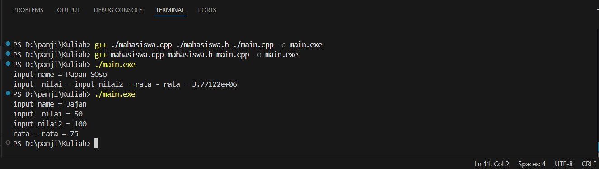
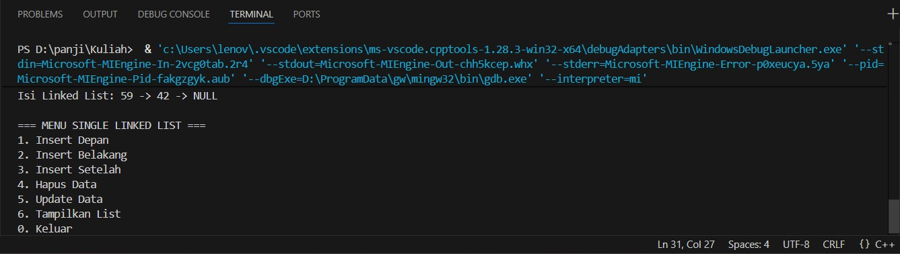
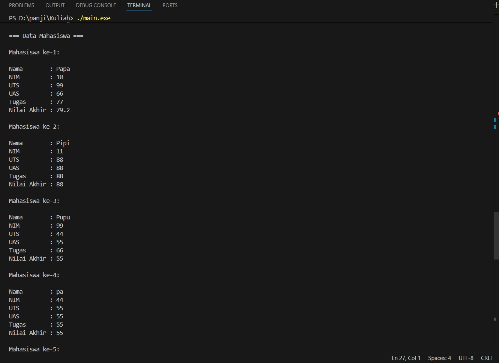
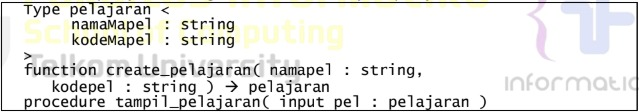
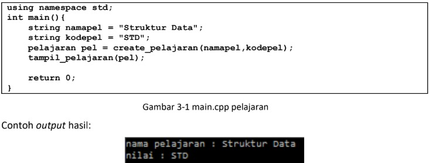
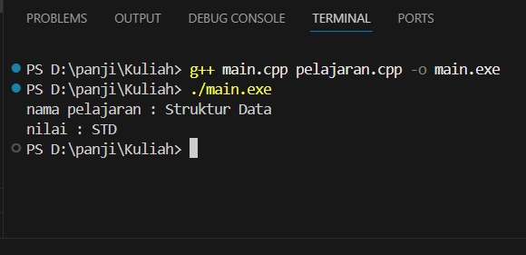

 # <h1 align="center">Laporan Praktikum Modul 3 <br> Abstract Data Type & Linked List</h1>
<p align="center">PANJI FAUZAN HABIBULLAH GALANG SOKYA WHIJAYA - 103112430162</p>

## Dasar Teori

Abstract Data Type (ADT) adalah model konseptual yang mendefinisikan operasi dan perilaku suatu struktur data tanpa menjelaskan bagaimana operasi tersebut diimplementasikan. ADT hanya menjelaskan apa yang dilakukan, bukan bagaimana cara melakukannya, sehingga bersifat abstrak dan tidak tergantung pada implementasi.

Dalam C++, linked list adalah struktur data linear yang menyimpan data di memori tidak berurutan. Setiap elemen disebut node, dan tiap node memiliki dua bagian utama:
- Data/value – menyimpan nilai.
- Pointer – menyimpan alamat node berikutnya (atau sebelumnya).

## Guided

### soal 1
mahasiswa.cpp, mahasiswa.h, dan main.cpp

```go
#include "mahasiswa.h"
#include <iostream>
using namespace std;

void inputMhs(mahasiswa &m)
{
    cout << "input name = ";
    cin >> (m).nim;
    cout << "input  nilai = ";
    cin >> (m).nilai1;
    cout << "input nilai2 = ";
    cin >> (m).nilai2;
}
float rata2(mahasiswa m)
{
    return float(m.nilai1+m.nilai2)/2;
}
```
```go
#ifndef MAHASISWA_H_INCLUDED
#define MAHASISWA_H_INCLUDED
    struct mahasiswa
    {
        char nim[10];
        int nilai1, nilai2;
    };
    void inputMhs(mahasiswa &m);
    float rata2(mahasiswa m);
    #endif
```
```go
#include <iostream>
#include "mahasiswa.h"
using namespace std;

int main()
{
    mahasiswa mhs;
    inputMhs(mhs);
    cout << "rata - rata = " << rata2(mhs);
    return 0;
}
```

> Output
> 

Program ini terdiri dari tiga file: mahasiswa.h, mahasiswa.cpp, dan main.cpp. File mahasiswa.h berisi definisi struct mahasiswa dengan atribut nim, nilai1, dan nilai2, serta deklarasi fungsi inputMhs() dan rata2(). File mahasiswa.cpp berisi implementasi fungsi-fungsi tersebut. Fungsi inputMhs() menerima parameter bertipe referensi dan meminta pengguna memasukkan NIM serta dua nilai, lalu menyimpannya ke dalam variabel mahasiswa. Fungsi rata2() menghitung dan mengembalikan rata-rata dari dua nilai mahasiswa dalam bentuk float. Pada main.cpp, dibuat variabel mhs bertipe mahasiswa, kemudian dipanggil inputMhs(mhs) untuk mengisi data dan rata2(mhs) untuk menghitung rata-rata, lalu hasilnya ditampilkan. Program ini menunjukkan penggunaan struct, parameter by reference, serta pemisahan kode dengan file header dan implementasi.

### soal 2
linkedlist.cpp

```go
#include <iostream>
using namespace std;

// Struktur Node
struct Node {
    int data;
    Node* next;
};

// Pointer awal dan akhir
Node* head = nullptr;

// Fungsi untuk membuat node baru
Node* createNode(int data) {
    Node* newNode = new Node();
    newNode->data = data;
    newNode->next = nullptr;
    return newNode;
}


void insertBelakang(int data) {
    Node* newNode = createNode(data);
    if (head == nullptr) {
        head = newNode;
    } else {
        Node* temp = head;
        while (temp->next != nullptr) {
            temp = temp->next;
        }
        temp->next = newNode;
    }
    cout << "Data " << data << " berhasil ditambahkan di belakang.\n";
}

void insertSetelah(int target, int dataBaru) {
    Node* temp = head;
    while (temp != nullptr && temp->data != target) {
        temp = temp->next;
    }

    if (temp == nullptr) {
        cout << "Data " << target << " tidak ditemukan!\n";
    } else {
        Node* newNode = createNode(dataBaru);
        newNode->next = temp->next;
        temp->next = newNode;
        cout << "Data " << dataBaru << " berhasil disisipkan setelah " << target << ".\n";
    }
}

// ========== DELETE FUNCTION ==========
void hapusNode(int data) {
    if (head == nullptr) {
        cout << "List kosong!\n";
        return;
    }

    Node* temp = head;
    Node* prev = nullptr;

    // Jika data di node pertama
    if (temp != nullptr && temp->data == data) {
        head = temp->next;
        delete temp;
        cout << "Data " << data << " berhasil dihapus.\n";
        return;
    }

    // Cari node yang akan dihapus
    while (temp != nullptr && temp->data != data) {
        prev = temp;
        temp = temp->next;
    }

    // Jika data tidak ditemukan
    if (temp == nullptr) {
        cout << "Data " << data << " tidak ditemukan!\n";
        return;
    }

    prev->next = temp->next;
    delete temp;
    cout << "Data " << data << " berhasil dihapus.\n";
}

// ========== UPDATE FUNCTION ==========
void updateNode(int dataLama, int dataBaru) {
    Node* temp = head;
    while (temp != nullptr && temp->data != dataLama) {
        temp = temp->next;
    }

    if (temp == nullptr) {
        cout << "Data " << dataLama << " tidak ditemukan!\n";
    } else {
        temp->data = dataBaru;
        cout << "Data " << dataLama << " berhasil diupdate menjadi " << dataBaru << ".\n";
    }
}

// ========== DISPLAY FUNCTION ==========
void tampilkanList() {
    if (head == nullptr) {
        cout << "List kosong!\n";
        return;
    }

    Node* temp = head;
    cout << "Isi Linked List: ";
    while (temp != nullptr) {
        cout << temp->data << " -> ";
        temp = temp->next
    }
    cout << "NULL\n";
}

// ========== MAIN PROGRAM ==========
int main() {
    int pilihan, data, target, dataBaru;

    do {
        cout << "\n=== MENU SINGLE LINKED LIST ===\n";
        cout << "1. Insert Depan\n";
        cout << "2. Insert Belakang\n";
        cout << "3. Insert Setelah\n";
        cout << "4. Hapus Data\n";
        cout << "5. Update Data\n";
        cout << "6. Tampilkan List\n";
        cout << "0. Keluar\n";
        cout << "Pilih: ";
        cin >> pilihan;

        switch (pilihan) {
            case 1:
                cout << "Masukkan data: ";
                cin >> data;
                insertDepan(data);
                break;
            case 2:
                cout << "Masukkan data: ";
                cin >> data;
                insertBelakang(data);
                break;
            case 3:
                cout << "Masukkan data target: ";
                cin >> target;
                cout << "Masukkan data baru: ";
                cin >> dataBaru;
                insertSetelah(target, dataBaru);
                break;
            case 4:
                cout << "Masukkan data yang ingin dihapus: ";
                cin >> data;
                hapusNode(data);
                break;
            case 5:
                cout << "Masukkan data lama: ";
                cin >> data;
                cout << "Masukkan data baru: ";
                cin >> dataBaru;
                updateNode(data, dataBaru);
                break;
            case 6:
                tampilkanList();
                break;
            case 0:
                cout << "Program selesai.\n";
                break;
            default:
                cout << "Pilihan tidak valid!\n";
        }
    } while (pilihan != 0);

    return 0;
}
```

> Output
> 

Program ini digunakan untuk mengelola data dalam struktur Single Linked List.
Program ini bisa:
- Menambah data (di depan, belakang, atau setelah data tertentu)
- Menghapus data berdasarkan nilainya
- Memperbarui data
- Menampilkan semua isi linked list

## Unguided

### Soal 1

Buat program yang dapat menyimpan data mahasiswa (max. 10) ke dalam sebuah array dengan field nama, nim, uts, uas, tugas, dan nilai akhir. Nilai akhir diperoleh dari FUNGSI dengan rumus 0.3uts+0.4uas+0.3*tugas.

unguided.cpp, unguided.h, dan unguided1.cpp
```go
#include "mahasiswa.h"
#include <iostream>
using namespace std;

float hitungNilaiAkhir(float uts, float uas, float tugas) {
    return 0.3 * uts + 0.4 * uas + 0.3 * tugas;
}

void inputData(Mahasiswa &m) {
    cout << "Masukkan Nama   : ";
    cin.ignore(); 
    getline(cin, m.nama);
    cout << "Masukkan NIM    : ";
    getline(cin, m.nim);
    cout << "Masukkan Nilai UTS  : ";
    cin >> m.uts;
    cout << "Masukkan Nilai UAS  : ";
    cin >> m.uas;
    cout << "Masukkan Nilai Tugas: ";
    cin >> m.tugas;

    m.nilaiAkhir = hitungNilaiAkhir(m.uts, m.uas, m.tugas);
}

void tampilData(const Mahasiswa m) {
    cout << "\nNama        : " << m.nama << endl;
    cout << "NIM         : " << m.nim << endl;
    cout << "UTS         : " << m.uts << endl;
    cout << "UAS         : " << m.uas << endl;
    cout << "Tugas       : " << m.tugas << endl;
    cout << "Nilai Akhir : " << m.nilaiAkhir << endl;
}
```
```go
#ifndef MAHASISWA_H
#define MAHASISWA_H

#include <string>
using namespace std;

struct Mahasiswa {
    string nama;
    string nim;
    float uts, uas, tugas, nilaiAkhir;
};

float hitungNilaiAkhir(float uts, float uas, float tugas);
void inputData(Mahasiswa &m);
void tampilData(const Mahasiswa m);

#endif
```
```go
#include <iostream>
#include "mahasiswa.h"
using namespace std;

int main() {
    Mahasiswa daftar[10];
    int n;

    cout << "Masukkan jumlah mahasiswa (maks 10): ";
    cin >> n;

    if (n > 10) n = 10;

    for (int i = 0; i < n; i++) {
        cout << "\n=== Input Mahasiswa ke-" << i + 1 << " ===" << endl;
        inputData(daftar[i]);
    }

    cout << "\n=== Data Mahasiswa ===" << endl;
    for (int i = 0; i < n; i++) {
        cout << "\nMahasiswa ke-" << i + 1 << ":" << endl;
        tampilData(daftar[i]);
    }

    return 0;
}
```

> Output
> 

Penjelasan:
- mahasiswa.h = berisi struktur Mahasiswa dan deklarasi fungsi untuk input, tampil, dan hitung nilai akhir.
- mahasiswa.cpp = berisi implementasi fungsi: menghitung nilai akhir (0.3*UTS + 0.4*UAS + 0.3*Tugas), input data, dan tampil data.
- main.cpp = program utama yang menyimpan max 10 mahasiswa, memanggil fungsi input dan tampil.

### Soal 2

Buatlah ADT pelajaran sebagai berikut di dalam file “pelajaran.h”:
> 

Buatlah implementasi ADT pelajaran pada file “pelajaran.cpp”
Cobalah hasil implementasi ADT pada file “main.cpp”
> 

pelajaran.cpp, pelajaran.h, dan main.cpp
```go
#include "pelajaran.h"
#include <iostream>
using namespace std;

pelajaran create_pelajaran(string namaMapel, string kodeMapel) {
    pelajaran p;
    p.namaMapel = namaMapel;
    p.kodeMapel = kodeMapel;
    return p;
}

void tampil_pelajaran(pelajaran pel) {
    cout << "nama pelajaran : " << pel.namaMapel << endl;
    cout << "nilai : " << pel.kodeMapel << endl;
}
```
```go
#ifndef PELAJARAN_H
#define PELAJARAN_H
#include <string>
using namespace std;

struct pelajaran {
    string namaMapel;
    string kodeMapel;
};

pelajaran create_pelajaran(string namaMapel, string kodeMapel);
void tampil_pelajaran(pelajaran pel);

#endif
```
```go
#include <iostream>
#include "pelajaran.h"
using namespace std;

int main() {
    string namapel = "Struktur Data";
    string kodepel = "STD";
    pelajaran pel = create_pelajaran(namapel, kodepel);
    tampil_pelajaran(pel);
    return 0;
}
```

> Output
> 

Program ini menunjukkan cara membuat dan menampilkan data pelajaran menggunakan ADT

Ini penjelasan lebih lanjutnya: 

-pelajaran.h
 Berisi deklarasi struktur pelajaran dengan dua atribut: namaMapel dan kodeMapel.
 Juga mendefinisikan dua fungsi:
 *create_pelajaran() = membuat dan mengembalikan data pelajaran baru.
 *tampil_pelajaran() = menampilkan isi data pelajaran.

-pelajaran.cpp
 Berisi implementasi fungsi dari header:
 *create_pelajaran() mengisi dan mengembalikan struct pelajaran.
 *tampil_pelajaran() mencetak nama dan kode pelajaran ke layar.

-main.cpp
 Membuat objek pelajaran dengan memanggil create_pelajaran() dan menampilkannya lewat tampil_pelajaran().

### Soal 3

Buatlah program yang dapat memberikan input dan output sbb.
> 

```go
#include <iostream>
using namespace std;

int main() {
    int n;
    cout << "Input: ";
    cin >> n;
    cout << "Output: "<<endl;

    for (int i = n; i >= 1; i--) {

        for (int s = 0; s < (n - i); s++) {
            cout << "  ";
        }
        for (int j = i; j >= 1; j--) {
            cout << j << " ";
        }
        cout << "* ";
        for (int j = 1; j <= i; j++) {
            cout << j << " ";
        }
        cout << endl;
    }

    for (int s = 0; s < n; s++) {
        cout << "  ";
    }
    cout << "*" << endl;

    return 0;
}
```

> Output
> 

Program ini menampilkan pola angka simetris dengan bintang di tengahnya, berdasarkan input angka n. Program ini menggeser pola ke kanan setiap baris dengan penambahan spasi. Saya di sini menggunakan nested loop

## Referensi

1. https://en.wikipedia.org/wiki/Data_structure (diakses blablabla)
2. https://learn.microsoft.com/id-id/cpp/cpp/void-cpp?view=msvc-170
3. https://www.duniailkom.com/tutorial-belajar-c-plus-plus-tipe-data-float-dan-double-bahasa-c-plus-plus/
