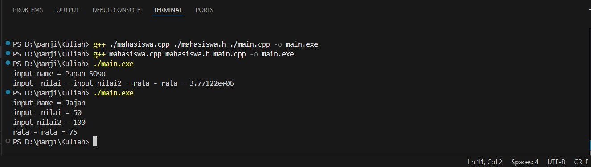
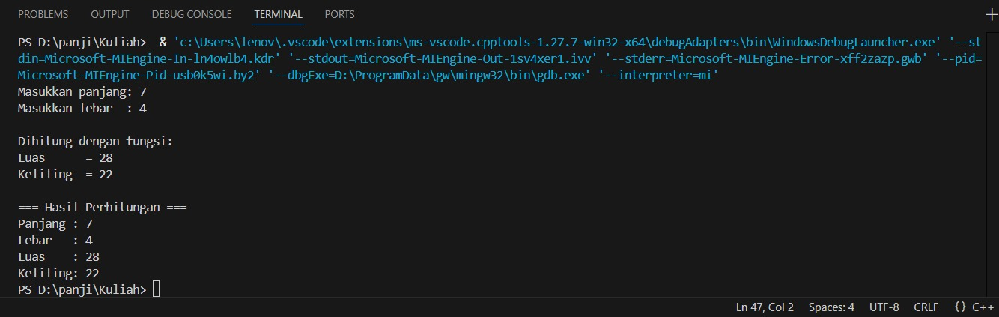
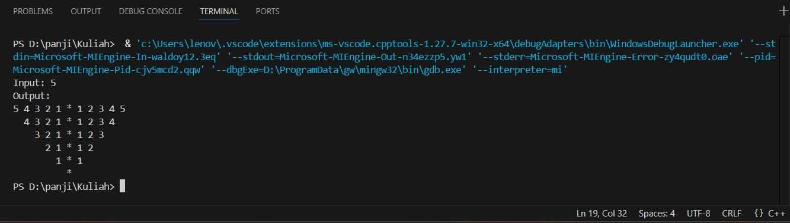

 # <h1 align="center">Laporan Praktikum Modul 3 <br> Abstract Data Type & Linked List</h1>
<p align="center">PANJI FAUZAN HABIBULLAH GALANG SOKYA WHIJAYA - 103112430162</p>

## Dasar Teori

Abstract Data Type (ADT) adalah model konseptual yang mendefinisikan operasi dan perilaku suatu struktur data tanpa menjelaskan bagaimana operasi tersebut diimplementasikan. ADT hanya menjelaskan apa yang dilakukan, bukan bagaimana cara melakukannya, sehingga bersifat abstrak dan tidak tergantung pada implementasi.

Dalam C++, linked list adalah struktur data linear yang menyimpan data di memori tidak berurutan. Setiap elemen disebut node, dan tiap node memiliki dua bagian utama:
- Data/value – menyimpan nilai.
- Pointer – menyimpan alamat node berikutnya (atau sebelumnya).

## Guided

### soal 1
mahasiswa.cpp, mahasiswa.h, dan main.cpp

```go
#include "mahasiswa.h"
#include <iostream>
using namespace std;

void inputMhs(mahasiswa &m)
{
    cout << "input name = ";
    cin >> (m).nim;
    cout << "input  nilai = ";
    cin >> (m).nilai1;
    cout << "input nilai2 = ";
    cin >> (m).nilai2;
}
float rata2(mahasiswa m)
{
    return float(m.nilai1+m.nilai2)/2;
}
```
```go
#ifndef MAHASISWA_H_INCLUDED
#define MAHASISWA_H_INCLUDED
    struct mahasiswa
    {
        char nim[10];
        int nilai1, nilai2;
    };
    void inputMhs(mahasiswa &m);
    float rata2(mahasiswa m);
    #endif
```
```go
#include <iostream>
#include "mahasiswa.h"
using namespace std;

int main()
{
    mahasiswa mhs;
    inputMhs(mhs);
    cout << "rata - rata = " << rata2(mhs);
    return 0;
}
```

> Output
> 

Program ini terdiri dari tiga file: mahasiswa.h, mahasiswa.cpp, dan main.cpp. File mahasiswa.h berisi definisi struct mahasiswa dengan atribut nim, nilai1, dan nilai2, serta deklarasi fungsi inputMhs() dan rata2(). File mahasiswa.cpp berisi implementasi fungsi-fungsi tersebut. Fungsi inputMhs() menerima parameter bertipe referensi dan meminta pengguna memasukkan NIM serta dua nilai, lalu menyimpannya ke dalam variabel mahasiswa. Fungsi rata2() menghitung dan mengembalikan rata-rata dari dua nilai mahasiswa dalam bentuk float. Pada main.cpp, dibuat variabel mhs bertipe mahasiswa, kemudian dipanggil inputMhs(mhs) untuk mengisi data dan rata2(mhs) untuk menghitung rata-rata, lalu hasilnya ditampilkan. Program ini menunjukkan penggunaan struct, parameter by reference, serta pemisahan kode dengan file header dan implementasi.

### soal 2
aritmatika.cpp

```go
#include <iostream>
using namespace std;

// Struktur Node
struct Node {
    int data;
    Node* next;
};

// Pointer awal dan akhir
Node* head = nullptr;

// Fungsi untuk membuat node baru
Node* createNode(int data) {
    Node* newNode = new Node();
    newNode->data = data;
    newNode->next = nullptr;
    return newNode;
}


void insertBelakang(int data) {
    Node* newNode = createNode(data);
    if (head == nullptr) {
        head = newNode;
    } else {
        Node* temp = head;
        while (temp->next != nullptr) {
            temp = temp->next;
        }
        temp->next = newNode;
    }
    cout << "Data " << data << " berhasil ditambahkan di belakang.\n";
}

void insertSetelah(int target, int dataBaru) {
    Node* temp = head;
    while (temp != nullptr && temp->data != target) {
        temp = temp->next;
    }

    if (temp == nullptr) {
        cout << "Data " << target << " tidak ditemukan!\n";
    } else {
        Node* newNode = createNode(dataBaru);
        newNode->next = temp->next;
        temp->next = newNode;
        cout << "Data " << dataBaru << " berhasil disisipkan setelah " << target << ".\n";
    }
}

// ========== DELETE FUNCTION ==========
void hapusNode(int data) {
    if (head == nullptr) {
        cout << "List kosong!\n";
        return;
    }

    Node* temp = head;
    Node* prev = nullptr;

    // Jika data di node pertama
    if (temp != nullptr && temp->data == data) {
        head = temp->next;
        delete temp;
        cout << "Data " << data << " berhasil dihapus.\n";
        return;
    }

    // Cari node yang akan dihapus
    while (temp != nullptr && temp->data != data) {
        prev = temp;
        temp = temp->next;
    }

    // Jika data tidak ditemukan
    if (temp == nullptr) {
        cout << "Data " << data << " tidak ditemukan!\n";
        return;
    }

    prev->next = temp->next;
    delete temp;
    cout << "Data " << data << " berhasil dihapus.\n";
}

// ========== UPDATE FUNCTION ==========
void updateNode(int dataLama, int dataBaru) {
    Node* temp = head;
    while (temp != nullptr && temp->data != dataLama) {
        temp = temp->next;
    }

    if (temp == nullptr) {
        cout << "Data " << dataLama << " tidak ditemukan!\n";
    } else {
        temp->data = dataBaru;
        cout << "Data " << dataLama << " berhasil diupdate menjadi " << dataBaru << ".\n";
    }
}

// ========== DISPLAY FUNCTION ==========
void tampilkanList() {
    if (head == nullptr) {
        cout << "List kosong!\n";
        return;
    }

    Node* temp = head;
    cout << "Isi Linked List: ";
    while (temp != nullptr) {
        cout << temp->data << " -> ";
        temp = temp->next
    }
    cout << "NULL\n";
}

// ========== MAIN PROGRAM ==========
int main() {
    int pilihan, data, target, dataBaru;

    do {
        cout << "\n=== MENU SINGLE LINKED LIST ===\n";
        cout << "1. Insert Depan\n";
        cout << "2. Insert Belakang\n";
        cout << "3. Insert Setelah\n";
        cout << "4. Hapus Data\n";
        cout << "5. Update Data\n";
        cout << "6. Tampilkan List\n";
        cout << "0. Keluar\n";
        cout << "Pilih: ";
        cin >> pilihan;

        switch (pilihan) {
            case 1:
                cout << "Masukkan data: ";
                cin >> data;
                insertDepan(data);
                break;
            case 2:
                cout << "Masukkan data: ";
                cin >> data;
                insertBelakang(data);
                break;
            case 3:
                cout << "Masukkan data target: ";
                cin >> target;
                cout << "Masukkan data baru: ";
                cin >> dataBaru;
                insertSetelah(target, dataBaru);
                break;
            case 4:
                cout << "Masukkan data yang ingin dihapus: ";
                cin >> data;
                hapusNode(data);
                break;
            case 5:
                cout << "Masukkan data lama: ";
                cin >> data;
                cout << "Masukkan data baru: ";
                cin >> dataBaru;
                updateNode(data, dataBaru);
                break;
            case 6:
                tampilkanList();
                break;
            case 0:
                cout << "Program selesai.\n";
                break;
            default:
                cout << "Pilihan tidak valid!\n";
        }
    } while (pilihan != 0);

    return 0;
}
```

> Output
> 

Program ini digunakan untuk mencari hasil aritmatika dari Z = (7+3)/(3+1). Z dideklarasikan menggunakan float dikarenakan hasil pembagian mempunyai kemungkinan desimal

### soal 3
perulangan.cpp

```go
#include <iostream>
using namespace std;
// int main()
// {
//     int jum;
//     cout << "jumlah perulangan: ";
//     cin >> jum;
//     for (int i = 0; i < jum; i++)
//     {
//         cout << "saya sahroni\n";
//     }
//     return 1;
// }


// while
int main()
{
    int i = 0;
    int jum;
    cin >> jum;
    do
    {
        cout << "bahlil ke-" << (i + 1) << endl;
        i++;
    } while (i < jum);
    return 0;
}
```

> Output
> 

Ini adalah program perulangan do while. Program ini akan mengulang kalimat "bahlil ke-[n]" sebanyak n(angka yang anda input).

### soal 4
kondisi.cpp

```go
#include <iostream>
using namespace std;
// int main()
// {
//     double tot_pembelian, diskon;
//     cout << "total pembelian: Rp";
//     cin >> tot_pembelian;
//     diskon = 0;
//     if (tot_pembelian >= 100000)
//         diskon = 0.05 * tot_pembelian;
//     cout << "besar diskon = Rp" << diskon;
// }


// int main()
// {
//     double tot_pembelian, diskon;
//     cout << "total pembelian: Rp";
//     cin >> tot_pembelian;
//     diskon = 0;
//     if (tot_pembelian >= 100000)
//         diskon = 0.05 * tot_pembelian;
//     else
//         diskon = 0;
//     cout << "besar diskon = Rp" << diskon;
// }


int main()
{
    int kode_hari;
    cout << "Menentukan hari kerja/libur\n"<<endl;
    cout << "1=Senin 3=Rabu 5=Jumat 7=Minggu "<<endl;
    cout << "2=Selasa 4=Kamis 6=Sabtu "<<endl;
    cin >> kode_hari;
    switch (kode_hari)
    {
    case 1:
    case 2:
    case 3:
    case 4:
    case 5:
        cout<<"Hari Kerja";
        break;
    case 6:
    case 7:
        cout<<"Hari Libur";
        break;
    default:
        cout<<"Kode masukan salah!!!";
    }
    return 0;
}
```

> Output
> 

Program ini digunakan untuk mencari tahu apakah hari yang diinput adalah hari kerja atau libur. Program ini menggunakan switch case

### soal 5
struct.cpp

```go
#include <iostream>
#include <string>
using namespace std;

// Definisi struct
struct Mahasiswa {
    string nama;
    string nim;
    float ipk;
};

int main() {

    Mahasiswa mhs1;

    cout << "Masukkan Nama Mahasiswa: ";
    getline(cin, mhs1.nama);
    // cin >> mhs1.nama;
    cout << "Masukkan NIM Mahasiswa : ";
    cin >> mhs1.nim;
    cout << "Masukkan IPK Mahasiswa : ";
    cin >> mhs1.ipk;

    cout << "\n=== Data Mahasiswa ===" << endl;
    cout << "Nama : " << mhs1.nama << endl;
    cout << "NIM  : " << mhs1.nim << endl;
    cout << "IPK  : " << mhs1.ipk << endl;

    return 0;
}
```

> Output
> 

Program ini menggunakan struct dan getline. Struct bisa menyimpan beberapa variabel dalam satu kesatuan dan getline digunakan agar kodenya dapat membaca satu baris penuh untuk nama (supaya bisa menerima spasi).

### soal 6
fungsi.cpp

```go
#include <iostream>
using namespace std;

// Prosedur: hanya menampilkan hasil, tidak mengembalikan nilai
void tampilkanHasil(double p, double l)
{
    cout << "\n=== Hasil Perhitungan ===" << endl;
    cout << "Panjang : " << p << endl;
    cout << "Lebar   : " << l << endl;
    cout << "Luas    : " << p * l << endl;
    cout << "Keliling: " << 2 * (p + l) << endl;
}

// Fungsi: mengembalikan nilai luas
double hitungLuas(double p, double l)
{
    return p * l;
}

// Fungsi: mengembalikan nilai keliling
double hitungKeliling(double p, double l)
{
    return 2 * (p + l);
}

int main()
{
    double panjang, lebar;

    cout << "Masukkan panjang: ";
    cin >> panjang;
    cout << "Masukkan lebar  : ";
    cin >> lebar;

    // Panggil fungsi
    double luas = hitungLuas(panjang, lebar);
    double keliling = hitungKeliling(panjang, lebar);

    cout << "\nDihitung dengan fungsi:" << endl;
    cout << "Luas      = " << luas << endl;
    cout << "Keliling  = " << keliling << endl;

    // Panggil prosedur
    tampilkanHasil(panjang, lebar);

    return 0;
}
```

> Output
> 

Program ini menghitung luas & keliling dengan fungsi dan prosedur. Di program ini ada 2 hal yang mungkin asing bagi anda, yaitu void dan double. Saat digunakan sebagai jenis pengembalian fungsi, void kata kunci menentukan bahwa fungsi tidak mengembalikan nilai sedangkan tipe double mengembalikan nilai berupa bilangan desimal. 

## Unguided

### Soal 1

Buatlah program yang menerima input-an dua buah bilangan betipe float, kemudian memberikan output-an hasil penjumlahan, pengurangan, perkalian, dan pembagian dari dua bilangan tersebut.

```go
#include <iostream>
using namespace std;

int main()
{
    double a,b,j,kr,kl,bg;

    cout<<"Input 2 bilangan: ";
    cin>>a;
    cin>>b;
    j=a+b;
    kr=a-b;
    kl=a*b;
    bg=a/b;
    
    cout<<"Penjumlahan="<<j<<"\nPengurangan="<<kr<<"\nPerkalian="<<kl<<"\nPembagian="<<bg<<endl;
    return 0;
}
```

> Output
> 

Program ini adalah program aritmatika sederhana yang menghitung hasil penjumlahan, pengurangan, perkalian, dan pembagian. Saya menggunakan double karena double adalah float untuk win64

### Soal 2

Buatlah sebuah program yang menerima masukan angka dan mengeluarkan output nilai angka tersebut dalam bentuk tulisan. Angka yang akan di-input-kan user adalah bilangan bulat positif mulai dari 0 s.d 100
contoh:
79: tujuh puluh Sembilan

```go
#include <iostream>
using namespace std;

string angkaKeTulisan(int n)
{
    string satuan[] = {"", "Satu", "Dua", "Tiga", "Empat", "Lima",
                       "Enam", "Tujuh", "Delapan", "Sembilan"};

    if (n == 0)
        return "Nol";
    else if (n == 10)
        return "Sepuluh";
    else if (n == 11)
        return "Sebelas";
    else if (n == 100)
        return "Seratus";
    else if (n < 10)
        return satuan[n];
    else if (n < 20)
    {
        int belas = n%10;
        string hasil = satuan[belas] + " Belas";
        return hasil;
    }
    else
    {
        int puluh = n / 10;
        int sisa = n % 10;
        string hasil = satuan[puluh] + " Puluh";
        if (sisa > 0)
            hasil += " " + satuan[sisa];
        return hasil;
    }
}

int main()
{
    int angka;
    cout << "Masukkan angka (0-100): ";
    cin >> angka;

    if (angka < 0 || angka > 100)
    {
        cout << "Angka di luar jangkauan!" << endl;
    }
    else
    {
        cout << angka << ": " << angkaKeTulisan(angka) << endl;
    }

    return 0;
}
```

> Output
> 

Program ini mengkonversi angka menjadi latin. Di sini saya menggunakan fungsi dan array

### Soal 3

Buatlah program yang dapat memberikan input dan output sbb.
> 

```go
#include <iostream>
using namespace std;

int main() {
    int n;
    cout << "Input: ";
    cin >> n;
    cout << "Output: "<<endl;

    for (int i = n; i >= 1; i--) {

        for (int s = 0; s < (n - i); s++) {
            cout << "  ";
        }
        for (int j = i; j >= 1; j--) {
            cout << j << " ";
        }
        cout << "* ";
        for (int j = 1; j <= i; j++) {
            cout << j << " ";
        }
        cout << endl;
    }

    for (int s = 0; s < n; s++) {
        cout << "  ";
    }
    cout << "*" << endl;

    return 0;
}
```

> Output
> 

Program ini menampilkan pola angka simetris dengan bintang di tengahnya, berdasarkan input angka n. Program ini menggeser pola ke kanan setiap baris dengan penambahan spasi. Saya di sini menggunakan nested loop

## Referensi

1. https://en.wikipedia.org/wiki/Data_structure (diakses blablabla)
2. https://learn.microsoft.com/id-id/cpp/cpp/void-cpp?view=msvc-170
3. https://www.duniailkom.com/tutorial-belajar-c-plus-plus-tipe-data-float-dan-double-bahasa-c-plus-plus/
