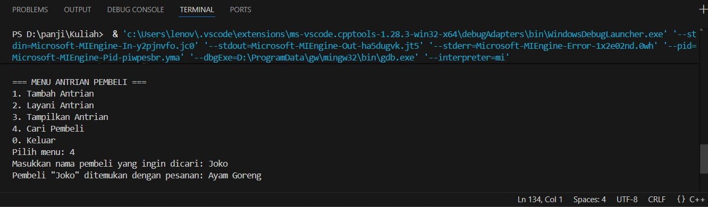
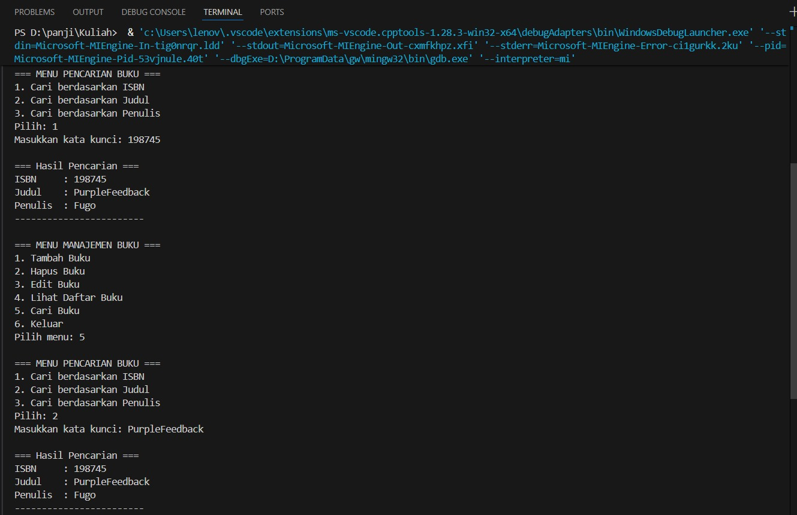

 # <h1 align="center">Laporan Praktikum Modul 5 <br> Single Linked List (Part 2)</h1>
<p align="center">PANJI FAUZAN HABIBULLAH GALANG SOKYA WHIJAYA - 103112430162</p>

## Dasar Teori

Untuk mencari sebuah elemen dalam linked list, kita harus melakukan iterasi melalui seluruh daftar, membandingkan setiap node dengan data yang dicari, dan terus mencari hingga ditemukan kecocokan. Karena linked list tidak mendukung akses acak, pencarian harus dimulai dari node pertama.

Diberikan sebuah linked list yang berisi bilangan bulat dan sebuah nilai kunci (key). Kita perlu menentukan apakah nilai kunci tersebut ada di dalam linked list atau tidak. Kita dapat menggunakan pencarian linear sederhana untuk menemukan key tersebut. Jika ditemukan, kita mengembalikan hasil “Ya”, jika tidak ditemukan maka “Tidak”.

## Guided

### soal 1

```go
#include <iostream>
using namespace std;

// Struktur Node
struct Node {
    int data;
    Node* next;
};

// Pointer awal dan akhir
Node* head = nullptr;

// Fungsi untuk membuat node baru
Node* createNode(int data) {
    Node* newNode = new Node();
    newNode->data = data;
    newNode->next = nullptr;
    return newNode;
}

void insertDepan(int data) {
    Node* newNode = createNode(data);
    newNode->next = head;
    head = newNode;
    cout << "Data" << data << " berhasil ditambahkan di depan.\n";
}


void insertBelakang(int data) {
    Node* newNode = createNode(data);
    if (head == nullptr) {
        head = newNode;
    } else {
        Node* temp = head;
        while (temp->next != nullptr) {
            temp = temp->next;
        }
        temp->next = newNode;
    }
    cout << "Data " << data << " berhasil ditambahkan di belakang.\n";
}

void insertSetelah(int target, int dataBaru) {
    Node* temp = head;
    while (temp != nullptr && temp->data != target) {
        temp = temp->next;
    }

    if (temp == nullptr) {
        cout << "Data " << target << " tidak ditemukan!\n";
    } else {
        Node* newNode = createNode(dataBaru);
        newNode->next = temp->next;
        temp->next = newNode;
        cout << "Data " << dataBaru << " berhasil disisipkan setelah " << target << ".\n";
    }
}

// ========== DELETE FUNCTION ==========
void hapusNode(int data) {
    if (head == nullptr) {
        cout << "List kosong!\n";
        return;
    }

    Node* temp = head;
    Node* prev = nullptr;

    // Jika data di node pertama
    if (temp != nullptr && temp->data == data) {
        head = temp->next;
        delete temp;
        cout << "Data " << data << " berhasil dihapus.\n";
        return;
    }

    // Cari node yang akan dihapus
    while (temp != nullptr && temp->data != data) {
        prev = temp;
        temp = temp->next;
    }

    // Jika data tidak ditemukan
    if (temp == nullptr) {
        cout << "Data " << data << " tidak ditemukan!\n";
        return;
    }

    prev->next = temp->next;
    delete temp;
    cout << "Data " << data << " berhasil dihapus.\n";
}

// ========== UPDATE FUNCTION ==========
void updateNode(int dataLama, int dataBaru) {
    Node* temp = head;
    while (temp != nullptr && temp->data != dataLama) {
        temp = temp->next;
    }

    if (temp == nullptr) {
        cout << "Data " << dataLama << " tidak ditemukan!\n";
    } else {
        temp->data = dataBaru;
        cout << "Data " << dataLama << " berhasil diupdate menjadi " << dataBaru << ".\n";
    }
}

// ========== DISPLAY FUNCTION ==========
void tampilkanList() {
    if (head == nullptr) {
        cout << "List kosong!\n";
        return;
    }

    Node* temp = head;
    cout << "Isi Linked List: ";
    while (temp != nullptr) {
        cout << temp->data << " -> ";
        temp = temp->next;
    }
    cout << "NULL\n";
}

// ========== MAIN PROGRAM ==========
int main() {
    int pilihan, data, target, dataBaru;

    do {
        cout << "\n=== MENU SINGLE LINKED LIST ===\n";
        cout << "1. Insert Depan\n";
        cout << "2. Insert Belakang\n";
        cout << "3. Insert Setelah\n";
        cout << "4. Hapus Data\n";
        cout << "5. Update Data\n";
        cout << "6. Tampilkan List\n";
        cout << "0. Keluar\n";
        cout << "Pilih: ";
        cin >> pilihan;

        switch (pilihan) {
            case 1:
                cout << "Masukkan data: ";
                cin >> data;
                insertDepan(data);
                break;
            case 2:
                cout << "Masukkan data: ";
                cin >> data;
                insertBelakang(data);
                break;
            case 3:
                cout << "Masukkan data target: ";
                cin >> target;
                cout << "Masukkan data baru: ";
                cin >> dataBaru;
                insertSetelah(target, dataBaru);
                break;
            case 4:
                cout << "Masukkan data yang ingin dihapus: ";
                cin >> data;
                hapusNode(data);
                break;
            case 5:
                cout << "Masukkan data lama: ";
                cin >> data;
                cout << "Masukkan data baru: ";
                cin >> dataBaru;
                updateNode(data, dataBaru);
                break;
            case 6:
                tampilkanList();
                break;
            case 0:
                cout << "Program selesai.\n";
                break;
            default:
                cout << "Pilihan tidak valid!\n";
        }
    } while (pilihan != 0);

    return 0;
}
```

> Output
> 

Program ini membuat Single Linked List yang dapat menambah, menghapus, mengubah, dan menampilkan data. Struktur Node menyimpan nilai data dan pointer ke node berikutnya, sedangkan head menjadi penunjuk awal list. Fungsi createNode membuat node baru, insertDepan, insertBelakang, dan insertSetelah menambah data di posisi berbeda. Fungsi hapusNode menghapus data tertentu, updateNode mengganti nilai data lama dengan yang baru, dan tampilkanList menampilkan isi list. Pada fungsi main, pengguna dapat memilih menu operasi hingga memilih keluar dari program.

## Unguided

### Soal 1

buatlah searcing untuk mencari nama pembeli pada unguided sebelumnya

```go
#include <iostream>
#include <string>
using namespace std;

struct Node {
    string nama;
    string pesanan;
    Node* next;
};

Node* front = nullptr;
Node* rear = nullptr;

Node* createNode(string nama, string pesanan) {
    Node* newNode = new Node();
    newNode->nama = nama;
    newNode->pesanan = pesanan;
    newNode->next = nullptr;
    return newNode;
}

void tambahAntrian(string nama, string pesanan) {
    Node* newNode = createNode(nama, pesanan);
    if (rear == nullptr) {
        front = rear = newNode;
    } else {
        rear->next = newNode;
        rear = newNode;
    }
    cout << "Pembeli " << nama << " dengan pesanan \"" << pesanan << "\" ditambahkan ke antrian.\n";
}

void layaniAntrian() {
    if (front == nullptr) {
        cout << "Antrian kosong, tidak ada yang dilayani.\n";
        return;
    }
    Node* temp = front;
    cout << "Melayani pembeli " << front->nama << " (pesanan: " << front->pesanan << ")\n";
    front = front->next;
    if (front == nullptr) {
        rear = nullptr;
    }
    delete temp;
}

void tampilkanAntrian() {
    if (front == nullptr) {
        cout << "Antrian kosong.\n";
        return;
    }
    Node* temp = front;
    cout << "\n=== Daftar Antrian Pembeli ===\n";
    while (temp != nullptr) {
        cout << "- " << temp->nama << " (Pesanan: " << temp->pesanan << ")\n";
        temp = temp->next;
    }
}

void cariPembeli(string namaCari) {
    if (front == nullptr) {
        cout << "Antrian kosong.\n";
        return;
    }

    Node* temp = front;
    bool ditemukan = false;

    while (temp != nullptr) {
        if (temp->nama == namaCari) {
            cout << "Pembeli \"" << temp->nama << "\" ditemukan dengan pesanan: " << temp->pesanan << endl;
            ditemukan = true;
            break;
        }
        temp = temp->next;
    }

    if (!ditemukan) {
        cout << "Pembeli dengan nama \"" << namaCari << "\" tidak ditemukan dalam antrian.\n";
    }
}

int main() {
    int pilihan;
    string nama, pesanan;

    do {
        cout << "\n=== MENU ANTRIAN PEMBELI ===\n";
        cout << "1. Tambah Antrian\n";
        cout << "2. Layani Antrian\n";
        cout << "3. Tampilkan Antrian\n";
        cout << "4. Cari Pembeli\n";
        cout << "0. Keluar\n";
        cout << "Pilih menu: ";
        cin >> pilihan;

        switch (pilihan) {
            case 1:
                cout << "Masukkan nama pembeli: ";
                cin.ignore();
                getline(cin, nama);
                cout << "Masukkan pesanan: ";
                getline(cin, pesanan);
                tambahAntrian(nama, pesanan);
                break;

            case 2:
                layaniAntrian();
                break;

            case 3:
                tampilkanAntrian();
                break;

            case 4:
                cout << "Masukkan nama pembeli yang ingin dicari: ";
                cin.ignore();
                getline(cin, nama);
                cariPembeli(nama);
                break;

            case 0:
                cout << "Program selesai.\n";
                break;

            default:
                cout << "Pilihan tidak valid!\n";
        }
    } while (pilihan != 0);

    return 0;
}
```

> Output
> 

Program ini menambahkan fitur pencarian pembeli dengan fungsi cariPembeli().
Fungsi ini akan menelusuri seluruh antrian dari depan hingga belakang, dan menampilkan data pembeli beserta pesanannya jika ditemukan. Jika tidak ditemukan, akan muncul pesan bahwa nama tidak ada dalam antrian.

### Soal 2

gunakan latihan pada pertemuan minggu ini dan tambahkan seardhing untuk mencari buku berdasarkan judul, penulis, dan ISBN

```go
#include <iostream>
#include <string>
using namespace std;

struct Buku {
    string isbn;
    string judul;
    string penulis;
    Buku* next;
};

Buku* head = nullptr;

void tambahBuku() {
    Buku* baru = new Buku();
    cout << "\nMasukkan ISBN     : ";
    cin >> baru->isbn;
    cin.ignore();
    cout << "Masukkan Judul    : ";
    getline(cin, baru->judul);
    cout << "Masukkan Penulis  : ";
    getline(cin, baru->penulis);
    baru->next = nullptr;

    if (head == nullptr) {
        head = baru;
    } else {
        Buku* temp = head;
        while (temp->next != nullptr)
            temp = temp->next;
        temp->next = baru;
    }
    cout << "Buku berhasil ditambahkan!\n";
}

void tampilkanBuku() {
    if (head == nullptr) {
        cout << "\nBelum ada buku dalam daftar.\n";
        return;
    }

    Buku* temp = head;
    cout << "\n=== Daftar Buku ===\n";
    while (temp != nullptr) {
        cout << "ISBN     : " << temp->isbn << endl;
        cout << "Judul    : " << temp->judul << endl;
        cout << "Penulis  : " << temp->penulis << endl;
        cout << "------------------------\n";
        temp = temp->next;
    }
}

void hapusBuku() {
    if (head == nullptr) {
        cout << "\nTidak ada buku untuk dihapus.\n";
        return;
    }

    string target;
    cout << "\nMasukkan ISBN buku yang ingin dihapus: ";
    cin >> target;

    Buku* temp = head;
    Buku* prev = nullptr;

    while (temp != nullptr && temp->isbn != target) {
        prev = temp;
        temp = temp->next;
    }

    if (temp == nullptr) {
        cout << "Buku dengan ISBN " << target << " tidak ditemukan.\n";
        return;
    }

    if (prev == nullptr)
        head = temp->next;
    else
        prev->next = temp->next;

    delete temp;
    cout << "Buku berhasil dihapus!\n";
}

void editBuku() {
    if (head == nullptr) {
        cout << "\nTidak ada buku untuk diedit.\n";
        return;
    }

    string target;
    cout << "\nMasukkan ISBN buku yang ingin diperbaiki: ";
    cin >> target;

    Buku* temp = head;
    while (temp != nullptr && temp->isbn != target)
        temp = temp->next;

    if (temp == nullptr) {
        cout << "Buku dengan ISBN " << target << " tidak ditemukan.\n";
        return;
    }

    cout << "\nData lama:\n";
    cout << "Judul   : " << temp->judul << endl;
    cout << "Penulis : " << temp->penulis << endl;

    cout << "\nMasukkan data baru:\n";
    cin.ignore();
    cout << "Judul baru   : ";
    getline(cin, temp->judul);
    cout << "Penulis baru : ";
    getline(cin, temp->penulis);

    cout << "Data buku berhasil diperbarui!\n";
}

void cariBuku() {
    if (head == nullptr) {
        cout << "\nBelum ada buku untuk dicari.\n";
        return;
    }

    int pilihanCari;
    string keyword;
    cout << "\n=== MENU PENCARIAN BUKU ===\n";
    cout << "1. Cari berdasarkan ISBN\n";
    cout << "2. Cari berdasarkan Judul\n";
    cout << "3. Cari berdasarkan Penulis\n";
    cout << "Pilih: ";
    cin >> pilihanCari;
    cin.ignore();

    cout << "Masukkan kata kunci: ";
    getline(cin, keyword);

    Buku* temp = head;
    bool ditemukan = false;

    cout << "\n=== Hasil Pencarian ===\n";
    while (temp != nullptr) {
        bool cocok = false;
        if (pilihanCari == 1 && temp->isbn == keyword)
            cocok = true;
        else if (pilihanCari == 2 && temp->judul == keyword)
            cocok = true;
        else if (pilihanCari == 3 && temp->penulis == keyword)
            cocok = true;

        if (cocok) {
            cout << "ISBN     : " << temp->isbn << endl;
            cout << "Judul    : " << temp->judul << endl;
            cout << "Penulis  : " << temp->penulis << endl;
            cout << "------------------------\n";
            ditemukan = true;
        }
        temp = temp->next;
    }

    if (!ditemukan)
        cout << "Tidak ditemukan buku dengan data tersebut.\n";
}

int main() {
    int pilihan;
    do {
        cout << "\n=== MENU MANAJEMEN BUKU ===\n";
        cout << "1. Tambah Buku\n";
        cout << "2. Hapus Buku\n";
        cout << "3. Edit Buku\n";
        cout << "4. Lihat Daftar Buku\n";
        cout << "5. Cari Buku\n";
        cout << "6. Keluar\n";
        cout << "Pilih menu: ";
        cin >> pilihan;

        switch (pilihan) {
        case 1: tambahBuku(); break;
        case 2: hapusBuku(); break;
        case 3: editBuku(); break;
        case 4: tampilkanBuku(); break;
        case 5: cariBuku(); break;
        case 6: cout << "Program selesai.\n"; break;
        default: cout << "Pilihan tidak valid.\n";
        }
    } while (pilihan != 6);

    return 0;
}
```

> Output
> 

Program ini menambahkan fitur pencarian buku (cariBuku()), di mana pengguna dapat memilih:
- Cari berdasarkan ISBN
- Cari berdasarkan Judul
- Cari berdasarkan Penulis
Program akan menelusuri seluruh node (linked list) dan menampilkan semua buku yang cocok dengan kata kunci.
Jika tidak ditemukan, akan muncul pesan: "Tidak ditemukan buku dengan data tersebut."

## Referensi

1. https://en.wikipedia.org/wiki/Data_structure (diakses blablabla)
2. [https://learn.microsoft.com/id-id/cpp/cpp/void-cpp?view=msvc-170
3. https://www.duniailkom.com/tutorial-belajar-c-plus-plus-tipe-data-float-dan-double-bahasa-c-plus-plus/
](https://www.tutorialspoint.com/searching-an-element-in-a-linked-list-using-cplusplus)
