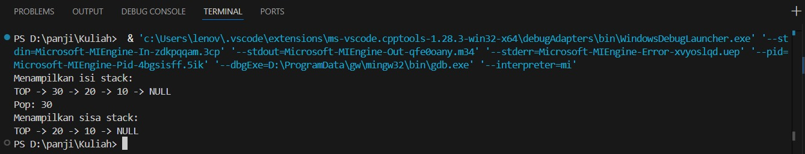
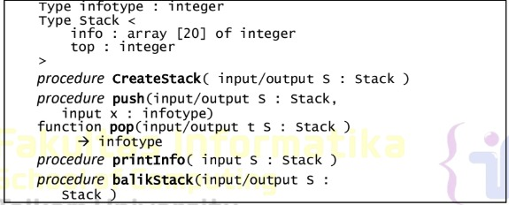
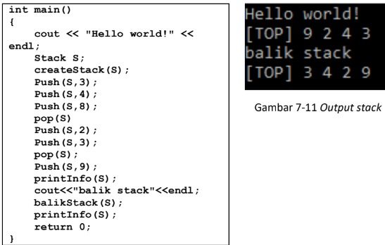
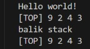
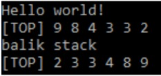
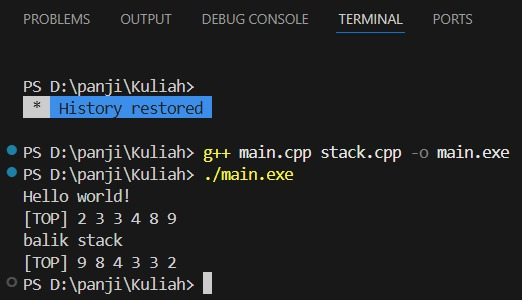
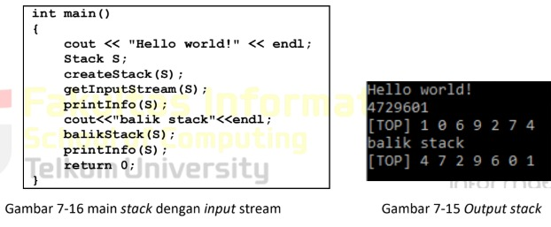
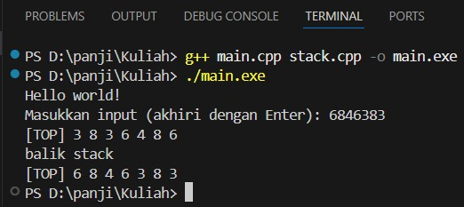

 # <h1 align="center">Laporan Praktikum Modul 7 <br> Stack</h1>
<p align="center">PANJI FAUZAN HABIBULLAH GALANG SOKYA WHIJAYA - 103112430162</p>

## Dasar Teori

Sebuah stack menyimpan banyak elemen dalam urutan tertentu yang disebut LIFO.

LIFO merupakan singkatan dari Last In, First Out (masuk terakhir, keluar pertama). Untuk memvisualisasikan konsep LIFO, bayangkan setumpuk pancake, di mana pancake ditambahkan dan diambil dari bagian atas tumpukan. Jadi, saat mengambil pancake, yang akan diambil selalu yang terakhir kali ditambahkan. Cara pengorganisasian elemen seperti ini disebut LIFO dalam computer science and programming.

Berbeda dengan vector, elemen dalam stack tidak dapat diakses menggunakan nomor indeks. Karena elemen selalu ditambahkan dan dihapus dari bagian atas, maka hanya elemen paling atas dari stack yang dapat diakses.

Untuk menggunakan stack, Anda harus menyertakan header file stack.

## Guided

### soal 1
guided1.cpp

```go
#include <iostream>
using namespace std;

struct Node
{
    int data;
    Node *next;
};

bool isEmpty(Node *top)
{
    return top == nullptr;
}

void push(Node *&top, int data)
{
    Node *newNode = new Node();
    newNode->data = data;
    newNode->next = top;
    top = newNode;
}

int pop(Node *&top)
{
    if (isEmpty(top))
    {
        cout << "Stack kosong, tidak bisa di pop!" << endl;
        return 0;
    }

    int poppedData = top->data;
    Node *temp = top;
    top = top->next;

    delete temp;
    return poppedData;
}

void show(Node *top)
{
    if (isEmpty(top))
    {
        cout << "Stack kosong." <<endl;
        return;
    }

    cout << "TOP -> ";
    Node *temp = top;

    while (temp != nullptr)
    {
        cout << temp->data << " -> ";
        temp = temp->next;
    }

    cout << "NULL" << endl;
}

int main()
{
    Node *stack = nullptr;

    push(stack, 10);
    push(stack, 20);
    push(stack, 30);

    cout << "Menampilkan isi stack:" << endl;
    show(stack);

    cout << "Pop: " << pop(stack) << endl;

    cout << "Menampilkan sisa stack:" << endl;
    show(stack);

    return 0;
}
```

> Output
> 

Struktur:
- Node berisi data dan pointer next.
- top menunjuk ke elemen paling atas stack.

Fungsi utama:
- isEmpty() = cek apakah stack kosong.
- push() = menambah data ke atas stack.
- pop() = menghapus dan mengembalikan data paling atas.
- show() = menampilkan isi stack dari atas ke bawah.

## Unguided

### Soal 1

Buatlah ADT Stack menggunakan ARRAY sebagai berikut di dalam file “stack.h”:
> 

Buatlah implementasi ADT Stack menggunakan Array pada file “stack.cpp” dan “main.cpp”
> 

stack.cpp, stack.h, dan main.cpp
```go
#include <iostream>
#include "stack.h"
using namespace std;

void createStack(Stack &S) {
    S.top = -1;
}

void push(Stack &S, infotype x) {
    if (S.top < MAX - 1) {
        S.top++;
        S.info[S.top] = x;
    } else {
        cout << "Stack penuh!\n";
    }
}

infotype pop(Stack &S) {
    if (S.top >= 0) { 
        infotype x = S.info[S.top];
        S.top--;
        return x;
    } else {
        cout << "Stack kosong!\n";
        return -1;
    }
}

void printInfo(Stack S) {
    if (S.top == -1) {
        cout << "Stack kosong.\n";
        return;
    }

    cout << "[TOP] ";
    for (int i = S.top; i >= 0; i--) {
        cout << S.info[i] << " ";
    }
    cout << endl;
}

void balikStack(Stack &S) {
    Stack temp;
    createStack(temp);

    while (S.top != -1) {
        push(temp, pop(S));
    }

    S = temp;
}
```
```go
#ifndef STACK_H
#define STACK_H

const int MAX = 20;

typedef int infotype;

struct Stack {
    infotype info[MAX];
    int top;
};

void createStack(Stack &S);
void push(Stack &S, infotype x);
infotype pop(Stack &S);
void printInfo(Stack S);
void balikStack(Stack &S);

#endif
```
```go
#include <iostream>
#include "stack.h"
using namespace std;

int main() {
    cout << "Hello world!" << endl;

    Stack S;
    createStack(S);

    push(S, 3);
    push(S, 4);
    push(S, 8);
    pop(S);
    push(S, 2);
    push(S, 3);
    pop(S);
    push(S, 9);

    printInfo(S);

    cout << "balik stack" << endl;
    balikStack(S);
    printInfo(S);

    return 0;
}
```

> Output
> 

Program ini membuat ADT Stack (tumpukan) menggunakan array.
Stack menyimpan data secara LIFO (Last In, First Out), data terakhir yang dimasukkan akan keluar lebih dulu.
- createStack() = menginisialisasi stack agar kosong.
- push() = menambah data ke puncak stack.
- pop() = menghapus data dari puncak stack.
- printInfo() = menampilkan isi stack dari atas ke bawah.
- balikStack() = membalik urutan isi stack.

Pada program utama (main.cpp), beberapa data dimasukkan dan dihapus, lalu isi stack ditampilkan sebelum dan sesudah dibalik.
Hasilnya menunjukkan bahwa urutan data dalam stack berhasil dibalik.

### Soal 2

Tambahkan prosedur pushAscending( in/out S : Stack, in x : integer)
```go
int main()
{
cout << "Hello world!" << endl;
Stack S;
createStack(S);
pushAscending(S,3);
pushAscending(S,4);
pushAscending(S,8);
pushAscending(S,2);
pushAscending(S,3);
pushAscending(S,9);
printInfo(S);
cout<<"balik stack"<<endl;
balikStack(S);
printInfo(S);
return 0;
}
```
> 

stack.cpp, stack.h, dan main.cpp
```go
#include <iostream>
#include "Stack.h"
using namespace std;

void createStack(Stack &S) {
    S.top = -1;
}

bool isEmpty(Stack S) {
    return S.top == -1;
}

void push(Stack &S, int x) {
    if (S.top < MAX - 1) {
        S.top++;
        S.info[S.top] = x;
    } else {
        cout << "Stack penuh!\n";
    }
}

int pop(Stack &S) {
    if (S.top >= 0) {
        int x = S.info[S.top];
        S.top--;
        return x;
    } else {
        cout << "Stack kosong!\n";
        return -1;
    }
}

void printInfo(Stack S) {
     if (S.top == -1) {
        cout << "Stack kosong.\n";
        return;
    }

    cout << "[TOP] ";
    for (int i = S.top; i >= 0; i--) {
        cout << S.info[i] << " ";
    }
    cout << endl;
}

void balikStack(Stack &S) {
    Stack temp;
    createStack(temp);

    while (S.top != -1) {
        push(temp, pop(S));
    }

    S = temp;
}

void pushAscending(Stack &S, int x) {
    Stack temp;
    createStack(temp);

    while (!isEmpty(S) && S.info[S.top] > x) {
        push(temp, pop(S));
    }

    push(S, x);

    while (!isEmpty(temp)) {
        push(S, pop(temp));
    }
}
```
```go
#ifndef STACK_H
#define STACK_H

const int MAX = 20;

struct Stack {
    int info[MAX];
    int top;
};

void createStack(Stack &S);
bool isEmpty(Stack S);
void push(Stack &S, int x);
int pop(Stack &S);
void printInfo(Stack S);
void balikStack(Stack &S);
void pushAscending(Stack &S, int x);

#endif
```
```go
#include <iostream>
#include "Stack.h"
using namespace std;

int main() {
    cout << "Hello world!" << endl;

    Stack S;
    createStack(S);

    pushAscending(S, 3);
    pushAscending(S, 4);
    pushAscending(S, 8);
    pushAscending(S, 2);
    pushAscending(S, 3);
    pushAscending(S, 9);

    printInfo(S);

    cout << "balik stack" << endl;
    balikStack(S);
    printInfo(S);

    return 0;
}
```

> Output
> 

Penjelasan:
- pushAscending() menjaga agar elemen selalu dalam urutan menaik (ascending).
- Jika elemen baru lebih besar dari elemen atas, elemen tersebut disisipkan di posisi yang tepat dengan bantuan stack sementara.
- Setelah semua elemen dimasukkan, hasil akhir akan menampilkan urutan yang terjaga.

### Soal 3

Tambahkan prosedur getInputStream( in/out S : Stack ). Prosedur akan terus membaca dan
menerima input user dan memasukkan setiap input ke dalam stack hingga user menekan
tombol enter. Contoh: gunakan cin.get() untuk mendapatkan inputan user.
> 

stack.cpp, stack.h, dan main.cpp
```go
#include "Stack.h"
#include <iostream>
using namespace std;

void createStack(Stack &S) {
    S.top = -1;
}

bool isEmpty(Stack S) {
    return S.top == -1;
}

bool isFull(Stack S) {
    return S.top == MAX - 1;
}

void push(Stack &S, int x) {
    if (!isFull(S)) {
        S.top++;
        S.info[S.top] = x;
    } else {
        cout << "Stack penuh!\n";
    }
}

int pop(Stack &S) {
    if (!isEmpty(S)) {
        int x = S.info[S.top];
        S.top--;
        return x;
    } else {
        cout << "Stack kosong!\n";
        return -1;
    }
}

void printInfo(Stack S) {
    cout << "[TOP] ";
    for (int i = S.top; i >= 0; i--) {
        cout << S.info[i] << " ";
    }
    cout << endl;
}

void balikStack(Stack &S) {
    Stack temp;
    createStack(temp);
    while (!isEmpty(S)) {
        push(temp, pop(S));
    }
    S = temp;
}

void pushAscending(Stack &S, int x) {
    Stack temp;
    createStack(temp);

    while (!isEmpty(S) && S.info[S.top] < x) {
        push(temp, pop(S));
    }

    push(S, x);

    while (!isEmpty(temp)) {
        push(S, pop(temp));
    }
}

// === Prosedur baru ===
void getInputStream(Stack &S) {
    char ch;
    cout << "Masukkan input (akhiri dengan Enter): ";
    while (true) {
        ch = cin.get(); // ambil karakter
        if (ch == '\n') break; // berhenti jika Enter
        push(S, ch - '0');     // konversi char angka ke int
    }
}
```
```go
#ifndef STACK_H
#define STACK_H

const int MAX = 20;

struct Stack {
    int info[MAX];
    int top;
};

void createStack(Stack &S);
bool isEmpty(Stack S);
bool isFull(Stack S);
void push(Stack &S, int x);
int pop(Stack &S);
void printInfo(Stack S);
void balikStack(Stack &S);
void pushAscending(Stack &S, int x);
void getInputStream(Stack &S); // <-- prosedur baru

#endif
```
```go
#include <iostream>
#include "Stack.h"
using namespace std;

int main() {
    cout << "Hello world!" << endl;

    Stack S;
    createStack(S);

    getInputStream(S);  // ← input dari user

    printInfo(S);

    cout << "balik stack" << endl;
    balikStack(S);
    printInfo(S);

    return 0;
}
```

> Output
> 

Program ini membuat ADT Stack berbasis array yang dapat menyimpan data secara LIFO (Last In First Out).

Penjelasan:
- createStack() membuat stack kosong.
- push() dan pop() menambah atau menghapus elemen.
- printInfo() menampilkan isi stack dari atas ke bawah.
- balikStack() membalik urutan elemen dalam stack.
- pushAscending() menambahkan elemen agar urutan tetap menaik.
- getInputStream() membaca input dari pengguna (hingga tekan Enter) dan memasukkannya ke stack.

Pada main(), program menampilkan teks “Hello world!”, meminta input angka, menampilkan isi stack, lalu membalik dan menampilkan hasilnya kembali.

## Referensi

1. https://en.wikipedia.org/wiki/Data_structure (diakses blablabla)
2. https://www.w3schools.com/cpp/cpp_stacks.asp
