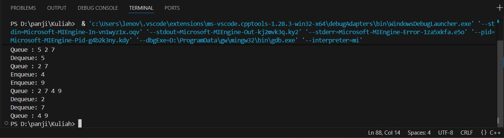
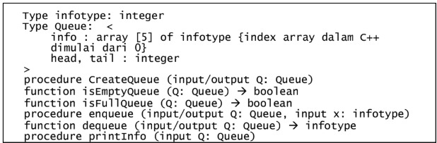
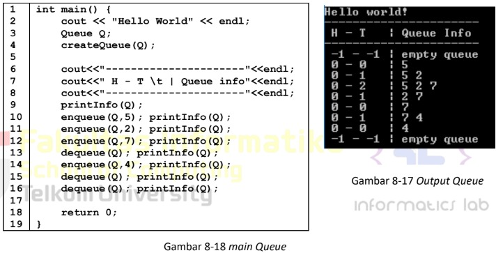

 # <h1 align="center">Laporan Praktikum Modul 8 <br> Queue</h1>
<p align="center">PANJI FAUZAN HABIBULLAH GALANG SOKYA WHIJAYA - 103112430162</p>

## Dasar Teori

Queue adalah struktur data linear yang mengikuti prinsip FIFO (First In First Out), artinya elemen yang pertama dimasukkan akan menjadi elemen pertama yang dikeluarkan.

Prinsip FIFO dalam Queue:

Prinsip FIFO menyatakan bahwa elemen pertama yang ditambahkan ke dalam antrian akan menjadi elemen pertama yang dihapus atau diproses. Dengan kata lain, Queue dapat diibaratkan seperti barisan orang yang sedang menunggu untuk membeli tiket, orang yang pertama dalam barisan akan dilayani terlebih dahulu (First Come, First Serve).

Istilah Dasar dalam Queue
- Front: Posisi elemen pertama dalam antrian yang siap untuk dihapus atau diproses disebut front atau head dari antrian.
- Rear: Posisi elemen terakhir dalam antrian, yaitu elemen yang baru saja ditambahkan, disebut rear atau tail dari antrian.
- Size: Menunjukkan jumlah elemen yang saat ini ada di dalam antrian.
- Capacity: Menunjukkan jumlah maksimum elemen yang dapat ditampung oleh antrian.

Operasi Dasar pada Queue
- Enqueue: Menambahkan elemen ke bagian belakang (rear) antrian. Jika antrian sudah penuh, maka terjadi overflow error.
- Dequeue: Menghapus elemen dari bagian depan (front) antrian. Jika antrian kosong, maka terjadi underflow error.
- Peek/Front: Mengembalikan elemen di bagian depan tanpa menghapusnya.
- Size: Mengembalikan jumlah elemen dalam antrian.
- isEmpty: Mengembalikan true jika antrian kosong, dan false jika tidak.
- isFull: Mengembalikan true jika antrian penuh, dan false jika tidak.

## Guided

### soal 1
guided1.cpp

```go
#include <iostream>
using namespace std;

#define MAX 5

struct Queue {
    int data[MAX];
    int head;
    int tail;
};

void createQueue(Queue &Q) {
    Q.head = -1;
    Q.tail = -1;
}

bool isEmpty(Queue Q) {
    return (Q.head == -1 && Q.tail == -1);
}

bool isFull(Queue Q) {
    return (Q.tail == MAX - 1);
}

void printQueue(Queue Q) {
    if (isEmpty(Q)) {
        cout << "Queue kosong!" << endl;
    } else {
        cout << "Queue : ";
        for (int i = Q.head; i <= Q.tail; i++) {
            cout << Q.data[i] << " ";
        }
        cout << endl;
    }
}

void enqueue(Queue &Q, int x) {
    if (isFull(Q)) {
        cout << "Queue penuh! Tidak bisa menambah data." << endl;
    } else {
        if (isEmpty(Q)) {
            Q.head = Q.tail = 0;
        } else {
            Q.tail++;
        }
        Q.data[Q.tail] = x;
        cout << "Enqueue: " << x << endl;
    }
}

void dequeue(Queue &Q) {
    if (isEmpty(Q)) {
        cout << "Queue kosong! Tiduk ada data yang dihapus." << endl;
    } else {
        cout << "Dequeue: " << Q.data[Q.head] << endl;

        if (Q.head == Q.tail) {
            Q.head = Q.tail = -1;
        } else {
            for (int i = Q.head; i < Q.tail; i++) {
                Q.data[i] = Q.data[i + 1];
            }
            Q.tail--;
        }
    }
}

int main() {
    Queue Q;
    createQueue(Q);

    enqueue(Q, 5);
    enqueue(Q, 2);
    enqueue(Q, 7);
    printQueue(Q);

    dequeue(Q);
    printQueue(Q);

    enqueue(Q, 4);
    enqueue(Q, 9);
    printQueue(Q);

    dequeue(Q);
    dequeue(Q);
    printQueue(Q);

    return 0;
}
```

> Output
> 

Penjelasan program ini:
- Queue menyimpan data dengan dua indeks: head (depan) dan tail (belakang).
- createQueue() menginisialisasi queue agar kosong (head dan tail = -1).
- enqueue() menambah data ke belakang queue selama belum penuh.
- dequeue() menghapus data dari depan queue dan menggeser elemen ke kiri.
- isEmpty() & isFull() memeriksa kondisi kosong/penuh.
- printQueue() menampilkan isi queue.

## Unguided

### Soal 1

Buatlah ADT Queue menggunakan ARRAY sebagai berikut di dalam file “queue.h”:
> 

Buatlah implementasi ADT Queue pada file “queue.cpp” dengan menerapkan mekanisme
queue Alternatif 1 (head diam, tail bergerak).
> 

queue.cpp, queue.h, main.cpp
```go
#include "queue.h"
#include <iostream>
using namespace std;

void createQueue(Queue &Q) {
    Q.head = -1;
    Q.tail = -1;
}

bool isEmptyQueue(Queue Q) {
    return (Q.head == -1 && Q.tail == -1);
}

bool isFullQueue(Queue Q) {
    return (Q.tail == MAX - 1);
}

void enqueue(Queue &Q, infotype x) {
    if (isFullQueue(Q)) {
        cout << "Queue penuh!" << endl;
        return;
    }

    if (isEmptyQueue(Q)) {
        Q.head = Q.tail = 0;
    } else {
        Q.tail++;
    }

    Q.info[Q.tail] = x;
}

infotype dequeue(Queue &Q) {
    if (isEmptyQueue(Q)) {
        cout << "Queue kosong!" << endl;
        return -1;
    }

    infotype x = Q.info[Q.head];

    if (Q.head == Q.tail) {
        Q.head = Q.tail = -1;
    } 
    else {
        for (int i = Q.head; i < Q.tail; i++) {
            Q.info[i] = Q.info[i + 1];
        }
        Q.tail--;
    }

    return x;
}

void printInfo(Queue Q) {
    cout << Q.head << " - " << Q.tail << "\t| Queue info : ";

    if (isEmptyQueue(Q)) {
        cout << "empty queue" << endl;
        return;
    }

    for (int i = Q.head; i <= Q.tail; i++) {
        cout << Q.info[i] << " ";
    }

    cout << endl;
}
```
```go
#ifndef QUEUE_H
#define QUEUE_H

const int MAX = 5;

typedef int infotype;

struct Queue {
    infotype info[MAX];
    int head, tail;
};

void createQueue(Queue &Q);
bool isEmptyQueue(Queue Q);
bool isFullQueue(Queue Q);
void enqueue(Queue &Q, infotype x);
infotype dequeue(Queue &Q);
void printInfo(Queue Q);

#endif
```
```go
#include <iostream>
#include "queue.h"
using namespace std;

int main() {
    cout << "Hello World" << endl;
    Queue Q;
    createQueue(Q);
    
    cout<<"----------------------"<<endl;
    cout<<" H - T \t | Queue info"<<endl;
    cout<<"----------------------"<<endl;
    printInfo(Q);
    enqueue(Q,5); printInfo(Q);
    enqueue(Q,2); printInfo(Q);
    enqueue(Q,7); printInfo(Q);
    dequeue(Q); printInfo(Q);
    dequeue(Q); printInfo(Q);
    enqueue(Q,4); printInfo(Q);
    dequeue(Q); printInfo(Q);
    dequeue(Q); printInfo(Q);

    return 0;
}
```

> Output
> 

Program ini adalah program aritmatika sederhana yang menghitung hasil penjumlahan, pengurangan, perkalian, dan pembagian. Saya menggunakan double karena double adalah float untuk win64

### Soal 2

Buatlah sebuah program yang menerima masukan angka dan mengeluarkan output nilai angka tersebut dalam bentuk tulisan. Angka yang akan di-input-kan user adalah bilangan bulat positif mulai dari 0 s.d 100
contoh:
79: tujuh puluh Sembilan

```go
#include <iostream>
using namespace std;

string angkaKeTulisan(int n)
{
    string satuan[] = {"", "Satu", "Dua", "Tiga", "Empat", "Lima",
                       "Enam", "Tujuh", "Delapan", "Sembilan"};

    if (n == 0)
        return "Nol";
    else if (n == 10)
        return "Sepuluh";
    else if (n == 11)
        return "Sebelas";
    else if (n == 100)
        return "Seratus";
    else if (n < 10)
        return satuan[n];
    else if (n < 20)
    {
        int belas = n%10;
        string hasil = satuan[belas] + " Belas";
        return hasil;
    }
    else
    {
        int puluh = n / 10;
        int sisa = n % 10;
        string hasil = satuan[puluh] + " Puluh";
        if (sisa > 0)
            hasil += " " + satuan[sisa];
        return hasil;
    }
}

int main()
{
    int angka;
    cout << "Masukkan angka (0-100): ";
    cin >> angka;

    if (angka < 0 || angka > 100)
    {
        cout << "Angka di luar jangkauan!" << endl;
    }
    else
    {
        cout << angka << ": " << angkaKeTulisan(angka) << endl;
    }

    return 0;
}
```

> Output
> 

Program ini mengkonversi angka menjadi latin. Di sini saya menggunakan fungsi dan array

### Soal 3

Buatlah program yang dapat memberikan input dan output sbb.
> 

```go
#include <iostream>
using namespace std;

int main() {
    int n;
    cout << "Input: ";
    cin >> n;
    cout << "Output: "<<endl;

    for (int i = n; i >= 1; i--) {

        for (int s = 0; s < (n - i); s++) {
            cout << "  ";
        }
        for (int j = i; j >= 1; j--) {
            cout << j << " ";
        }
        cout << "* ";
        for (int j = 1; j <= i; j++) {
            cout << j << " ";
        }
        cout << endl;
    }

    for (int s = 0; s < n; s++) {
        cout << "  ";
    }
    cout << "*" << endl;

    return 0;
}
```

> Output
> 

Program ini menampilkan pola angka simetris dengan bintang di tengahnya, berdasarkan input angka n. Program ini menggeser pola ke kanan setiap baris dengan penambahan spasi. Saya di sini menggunakan nested loop

## Referensi

1. https://en.wikipedia.org/wiki/Data_structure (diakses blablabla)
2. https://www.geeksforgeeks.org/dsa/introduction-to-queue-data-structure-and-algorithm-tutorials/
