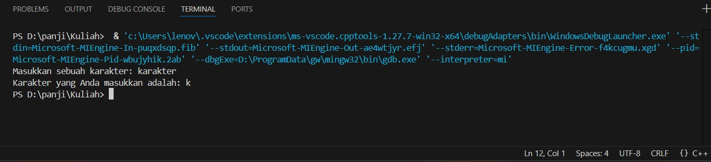
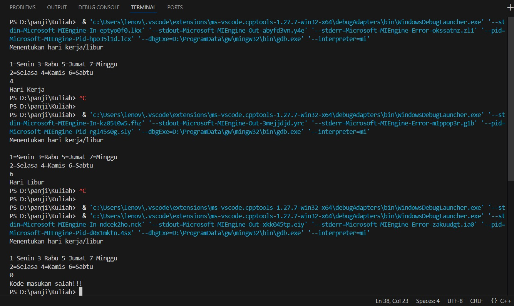

# <h1 align="center">Laporan Praktikum Modul X <br> Nama Modul</h1>
<p align="center">PANJI FAUZAN HABIBULLAH GALANG SOKYA WHIJAYA - 103112430162</p>

## Dasar Teori

C++ adalah bahasa pemrograman komputer yang dikembangkan oleh Bjarne Stroustrup sebagai pengembangan dari bahasa C, yang sebelumnya dibuat oleh Dennis Ritchie di Bell Labs. Pada awal 1970-an, bahasa C sendiri merupakan penyempurnaan dari bahasa B.

Awalnya, C++ dirancang untuk berjalan di sistem Unix. Seiring perkembangannya, standar ANSI C (American National Standards Institute) menjadi acuan utama, meskipun kini penggunaannya jarang ditemui dalam pengembangan sistem jaringan maupun sistem tertanam (embedded). Karena sifatnya yang fleksibel, C++ termasuk dalam kategori bahasa pemrograman tujuan umum (general-purpose programming language).

Stroustrup mulai mengembangkan C++ pada awal 1980-an di Bell Labs dengan menambahkan efisiensi dan dukungan untuk pemrograman tingkat rendah. Bahasa ini juga memperkenalkan konsep baru seperti class, inheritance, dan overloading. Perbedaan utama antara C dan C++ adalah dukungan penuh C++ terhadap paradigma pemrograman berorientasi objek (OOP).

## Guided

### soal 1
TEST.cpp

```go
#include <iostream>
using namespace std;
int main()
{
    string ch;
    cout << "Masukkan sebuah karakter: ";
    // cin >> ch;
    ch = getchar();  //Menggunakan getchar() untuk membaca satu karakter
    cout << "Karakter yang Anda masukkan adalah: " << ch << endl;
    return 0;
}
```

> Output
> 

Program ini akan mengambil huruf awal/char awal dari char-char yang diinput dengan menggunakan getchar()

### soal 2
aritmatika.cpp

```go
#include <iostream>
using namespace std;
int main()
{
    int W, X, Y;
    float Z;
    X = 7;
    Y = 3;
    W = 1;
    Z = (X + Y) / (Y + W);
    cout << "Nilai z = " << Z << endl;
    return 0;
}
```

> Output
> 

Program ini digunakan untuk mencari hasil aritmatika dari Z = (7+3)/(3+1). Z dideklarasikan menggunakan float dikarenakan hasil pembagian mempunyai kemungkinan desimal

### soal 3
perulangan.cpp

```go
#include <iostream>
using namespace std;
// int main()
// {
//     int jum;
//     cout << "jumlah perulangan: ";
//     cin >> jum;
//     for (int i = 0; i < jum; i++)
//     {
//         cout << "saya sahroni\n";
//     }
//     return 1;
// }


// while
int main()
{
    int i = 0;
    int jum;
    cin >> jum;
    do
    {
        cout << "bahlil ke-" << (i + 1) << endl;
        i++;
    } while (i < jum);
    return 0;
}
```

> Output
> 

Ini adalah program perulangan do while. Program ini akan mengulang kalimat "bahlil ke-[n]" sebanyak n(angka yang anda input).

### soal 4
kondisi.cpp

```go
#include <iostream>
using namespace std;
// int main()
// {
//     double tot_pembelian, diskon;
//     cout << "total pembelian: Rp";
//     cin >> tot_pembelian;
//     diskon = 0;
//     if (tot_pembelian >= 100000)
//         diskon = 0.05 * tot_pembelian;
//     cout << "besar diskon = Rp" << diskon;
// }


// int main()
// {
//     double tot_pembelian, diskon;
//     cout << "total pembelian: Rp";
//     cin >> tot_pembelian;
//     diskon = 0;
//     if (tot_pembelian >= 100000)
//         diskon = 0.05 * tot_pembelian;
//     else
//         diskon = 0;
//     cout << "besar diskon = Rp" << diskon;
// }


int main()
{
    int kode_hari;
    cout << "Menentukan hari kerja/libur\n"<<endl;
    cout << "1=Senin 3=Rabu 5=Jumat 7=Minggu "<<endl;
    cout << "2=Selasa 4=Kamis 6=Sabtu "<<endl;
    cin >> kode_hari;
    switch (kode_hari)
    {
    case 1:
    case 2:
    case 3:
    case 4:
    case 5:
        cout<<"Hari Kerja";
        break;
    case 6:
    case 7:
        cout<<"Hari Libur";
        break;
    default:
        cout<<"Kode masukan salah!!!";
    }
    return 0;
}
```

> Output
> 

Program ini digunakan untuk mencari tahu apakah hari yang diinput adalah hari kerja atau libur. Program ini menggunakan switch case

## Unguided

### Soal 1

copy paste soal nomor 1 disini

```go
package main

func main() {
	fmt.Println("Kode kalian disini")
	fmt.Println("JANGAN MASUKIN >>SCREENSHOT<< KODE KALIAN DISINI")
	fmt.Println("KALAU ADA -20 POIN LAPRAK")
}
```

> Output
> 
> %% Untuk mencantumkan screenshot, tidak boleh ada spasi di urlnya `()`, penamaan file bebas asal gak sara dan mudah dipahami aja,, dan jangan lupa hapus komen ini yah%%

Penjelasan ttg kode kalian disini

### Soal 2

soal nomor 2A

```go
package main

func main() {
	fmt.Println("kode untuk soal nomor 2A")
}
```

> Output
> 

penjelasan kode

Kalau adalanjutan di lanjut disini aja

soal nomor 2B

```go
package main

func main() {
	fmt.Println("kode untuk soal nomor 2B")
}
```

> Output
> 

penjelasan bedanya sesuai soal

## Referensi

1. https://en.wikipedia.org/wiki/Data_structure (diakses blablabla)
