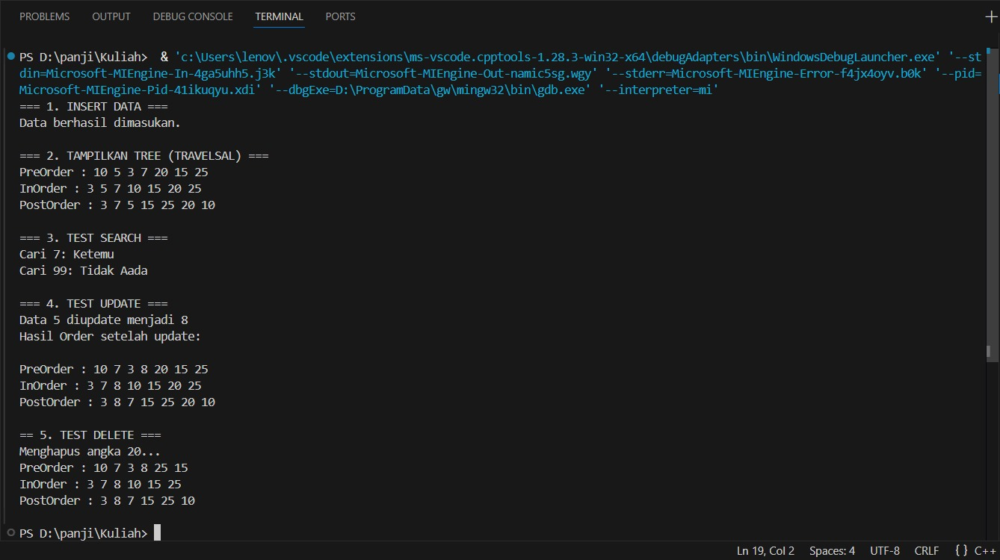

 # <h1 align="center">Laporan Praktikum Modul 10 <br> Rekursif</h1>
<p align="center">PANJI FAUZAN HABIBULLAH GALANG SOKYA WHIJAYA - 103112430162</p>

## Dasar Teori

Rekursi
Rekursi adalah teknik membuat suatu fungsi memanggil dirinya sendiri.
Rekurensi berlanjut bekerja hingga beberapa kondisi terpenuhi.
Untuk mencegah rekursi tak terbatas, pernyataan if...else (atau pendekatan serupa) dapat digunakan di mana satu cabang membuat panggilan rekursif dan yang lainnya tidak.

Rekursif menyediakan cara untuk memecah masalah rumit menjadi masalah sederhana yang lebih mudah dipecahkan.

Rekursi mungkin agak sulit dipahami. Cara terbaik untuk memahami cara kerjanya adalah dengan bereksperimen.

Keuntungan Rekursi C++
- Itu membuat kode kita lebih pendek dan bersih.
- Rekursi diperlukan dalam permasalahan yang berkaitan dengan struktur data dan algoritma tingkat lanjut, seperti Penelusuran Grafik dan Pohon.

Kekurangan Rekursi C++
- Dibutuhkan banyak ruang tumpukan dibandingkan dengan program berulang.
- Menggunakan lebih banyak waktu prosesor.
- Mungkin lebih sulit untuk men-debugnya dibandingkan dengan program iteratif yang setara.

## Guided

### soal 1
rekursif(tree).cpp

```go
#include <iostream>
using namespace std;

struct Node
{
    int data;
    Node *kiri, *kanan;
};

Node *buatNode(int nilai)
{
    Node *baru = new Node();
    baru->data = nilai;
    baru->kiri = baru->kanan = NULL;
    return baru;
}

Node *insert(Node *root, int nilai)
{
    if (root == NULL)
        return buatNode(nilai);
    
    if (nilai < root->data)
        root->kiri = insert(root->kiri, nilai);
    else if (nilai > root->data)
        root->kanan = insert(root->kanan, nilai);

    return root;
}

Node *search(Node *root, int nilai)
{
    if (root == NULL || root->data == nilai)
        return root;

    if (nilai < root->data)
        return search(root->kiri, nilai);

    return search(root->kanan, nilai);
}

Node *nilaiTerkecil(Node *node)
{
    Node *current = node;
    while (current && current->kiri != NULL)
        current = current->kiri;

        return current;
}

Node *hapus(Node *root, int nilai)
{
    if (root == NULL)
        return root;

    if (nilai < root->data)
        root->kiri = hapus(root->kiri, nilai);
    else if (nilai > root->data)
        root->kanan = hapus(root->kanan, nilai);
    else
    {
        if (root->kiri == NULL)
        {
            Node *temp = root->kanan;
            delete root;
            return temp;
        }
        else if (root->kanan == NULL){
            Node *temp = root->kiri;
            delete root;
            return temp;
        }
        Node *temp = nilaiTerkecil(root->kanan);
        root->data = temp->data;
        root->kanan = hapus(root->kanan, temp->data);
    }
    return root;
}

Node *update(Node *root, int Lama, int baru)
{
    if (search(root, Lama) != NULL)
    {
        root = hapus(root, Lama);
        root = insert(root, baru);
        cout << "Data " << Lama << " diupdate menjadi " << baru << endl;
    }
    else
    {
        cout << "Data " << Lama << " tidak ditemukan!" << endl;
    }
    return root;
}

void preOrder(Node *root)
{
    if (root != NULL)
    {
        cout << root->data << " ";
        preOrder(root->kiri);
        preOrder(root->kanan);
    }
}

void inOrder(Node *root)
{
    if (root != NULL)
    {
        inOrder(root->kiri);
        cout << root->data << " ";
        inOrder(root->kanan);
    }
}

void postOrder(Node *root)
{
    if (root != NULL)
    {
        postOrder(root->kiri);
        postOrder(root->kanan);
        cout << root->data << " ";
    }
}

int main()
{
    Node *root = NULL;

    cout << "=== 1. INSERT DATA ===" << endl;
    root = insert(root, 10);
    insert(root, 5);
    insert(root, 20);
    insert(root, 3);
    insert(root, 7);
    insert(root, 15);
    insert(root, 25);
    cout << "Data berhasil dimasukan.\n" << endl;

    cout << "=== 2. TAMPILKAN TREE (TRAVELSAL) ===" << endl;
    cout << "PreOrder : ";
    preOrder(root);
    cout << endl;
    cout << "InOrder : ";
    inOrder(root);
    cout << endl;
    cout << "PostOrder : ";
    postOrder(root);
    cout << "\n" << endl;

    cout << "=== 3. TEST SEARCH ===" << endl;
    int cari1 = 7, cari2 = 99;
    cout << "Cari " << cari1 << ": " << (search(root,cari1) ? "Ketemu" : "Tidak Aada") << endl;
    cout << "Cari " << cari2 << ": " << (search(root,cari2) ? "Ketemu" : "Tidak Aada") << endl;
    cout << endl;

    cout << "=== 4. TEST UPDATE ===" << endl;
    root = update(root, 5, 8);
    cout << "Hasil Order setelah update: ";
    cout << endl;
    cout << endl;

    cout << "PreOrder : ";
    preOrder(root);
    cout << endl;
    cout << "InOrder : ";
    inOrder(root);
    cout << endl;
    cout << "PostOrder : ";
    postOrder(root);
    cout << "\n" << endl;

    cout << "== 5. TEST DELETE ===" << endl;
    cout << "Menghapus angka 20..." << endl;
    root = hapus(root, 20);

    cout << "PreOrder : ";
    preOrder(root);
    cout << endl;
    cout << "InOrder : ";
    inOrder(root);
    cout << endl;
    cout << "PostOrder : ";
    postOrder(root);
    cout << "\n" << endl;

    return 0;
}
```

> Output
> 

Program ini membuat Binary Search Tree (BST) dengan fitur:
- Insert digunakan untuk menambah data sesuai aturan BST (kiri lebih kecil, kanan lebih besar).
- Search digunakan untuk mencari nilai di tree.
- Delete digunakan untuk menghapus node (tanpa anak, satu anak, atau dua anak).
- Update digunakan untuk menghapus nilai lama lalu memasukkan nilai baru.
- Traversal digunakan untuk menampilkan tree dengan PreOrder, InOrder, dan PostOrder.

Program melakukan semua operasi tersebut di fungsi main() untuk demonstrasi.

## Unguided

### Soal 1

Buatlah program yang menerima input-an dua buah bilangan betipe float, kemudian memberikan output-an hasil penjumlahan, pengurangan, perkalian, dan pembagian dari dua bilangan tersebut.

```go
#include <iostream>
using namespace std;

int main()
{
    double a,b,j,kr,kl,bg;

    cout<<"Input 2 bilangan: ";
    cin>>a;
    cin>>b;
    j=a+b;
    kr=a-b;
    kl=a*b;
    bg=a/b;
    
    cout<<"Penjumlahan="<<j<<"\nPengurangan="<<kr<<"\nPerkalian="<<kl<<"\nPembagian="<<bg<<endl;
    return 0;
}
```

> Output
> 

Program ini adalah program aritmatika sederhana yang menghitung hasil penjumlahan, pengurangan, perkalian, dan pembagian. Saya menggunakan double karena double adalah float untuk win64

### Soal 2

Buatlah sebuah program yang menerima masukan angka dan mengeluarkan output nilai angka tersebut dalam bentuk tulisan. Angka yang akan di-input-kan user adalah bilangan bulat positif mulai dari 0 s.d 100
contoh:
79: tujuh puluh Sembilan

```go
#include <iostream>
using namespace std;

string angkaKeTulisan(int n)
{
    string satuan[] = {"", "Satu", "Dua", "Tiga", "Empat", "Lima",
                       "Enam", "Tujuh", "Delapan", "Sembilan"};

    if (n == 0)
        return "Nol";
    else if (n == 10)
        return "Sepuluh";
    else if (n == 11)
        return "Sebelas";
    else if (n == 100)
        return "Seratus";
    else if (n < 10)
        return satuan[n];
    else if (n < 20)
    {
        int belas = n%10;
        string hasil = satuan[belas] + " Belas";
        return hasil;
    }
    else
    {
        int puluh = n / 10;
        int sisa = n % 10;
        string hasil = satuan[puluh] + " Puluh";
        if (sisa > 0)
            hasil += " " + satuan[sisa];
        return hasil;
    }
}

int main()
{
    int angka;
    cout << "Masukkan angka (0-100): ";
    cin >> angka;

    if (angka < 0 || angka > 100)
    {
        cout << "Angka di luar jangkauan!" << endl;
    }
    else
    {
        cout << angka << ": " << angkaKeTulisan(angka) << endl;
    }

    return 0;
}
```

> Output
> 

Program ini mengkonversi angka menjadi latin. Di sini saya menggunakan fungsi dan array

### Soal 3

Buatlah program yang dapat memberikan input dan output sbb.
> 

```go
#include <iostream>
using namespace std;

int main() {
    int n;
    cout << "Input: ";
    cin >> n;
    cout << "Output: "<<endl;

    for (int i = n; i >= 1; i--) {

        for (int s = 0; s < (n - i); s++) {
            cout << "  ";
        }
        for (int j = i; j >= 1; j--) {
            cout << j << " ";
        }
        cout << "* ";
        for (int j = 1; j <= i; j++) {
            cout << j << " ";
        }
        cout << endl;
    }

    for (int s = 0; s < n; s++) {
        cout << "  ";
    }
    cout << "*" << endl;

    return 0;
}
```

> Output
> 

Program ini menampilkan pola angka simetris dengan bintang di tengahnya, berdasarkan input angka n. Program ini menggeser pola ke kanan setiap baris dengan penambahan spasi. Saya di sini menggunakan nested loop

## Referensi

1. https://en.wikipedia.org/wiki/Data_structure (diakses blablabla)
2. https://www.programiz.com/cpp-programming/recursion
3. https://www.w3schools.com/cpp/cpp_functions_recursion.asp
