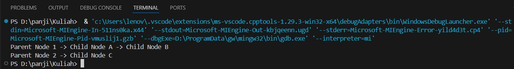
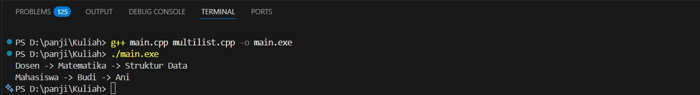
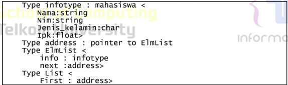
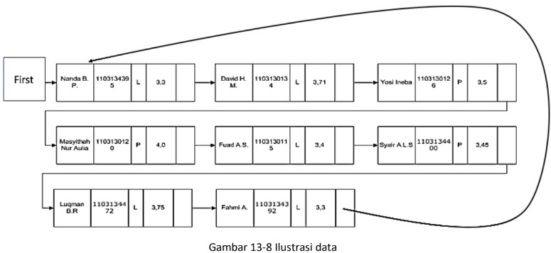
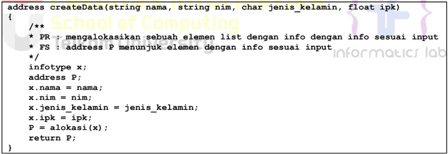
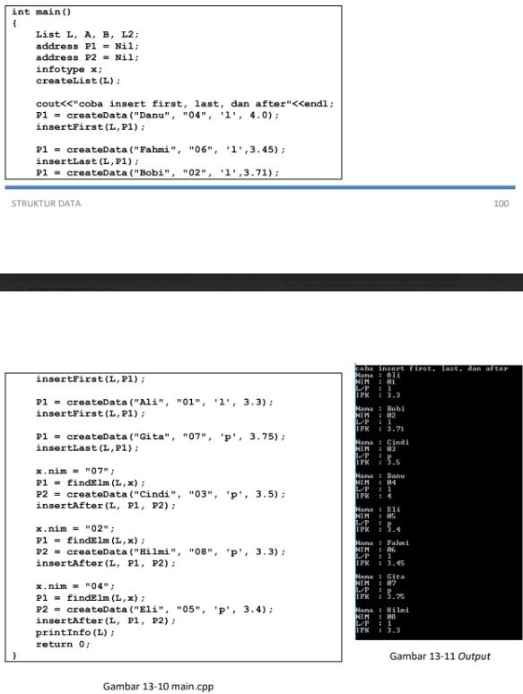
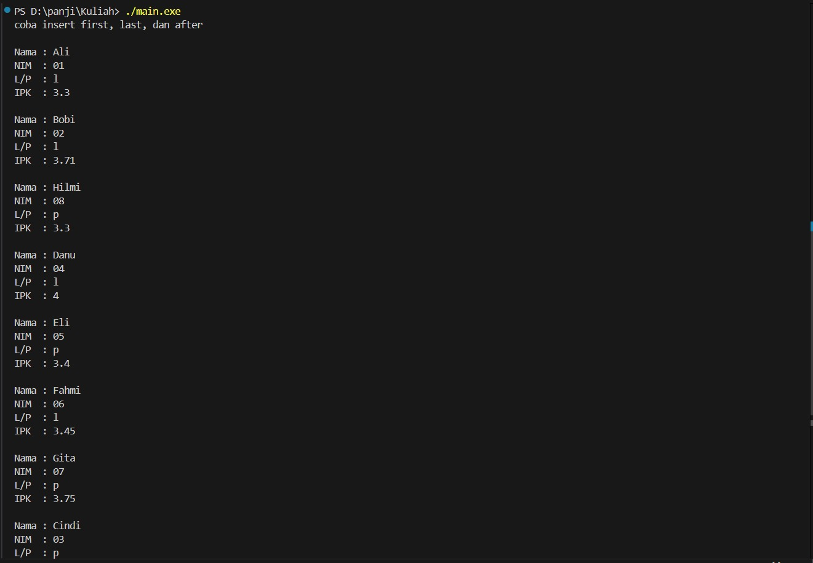

 # <h1 align="center">Laporan Praktikum Modul 13 <br> Multi-Linked List</h1>
<p align="center">PANJI FAUZAN HABIBULLAH GALANG SOKYA WHIJAYA - 103112430162</p>

## Dasar Teori

Multi-linked list adalah jenis daftar khusus yang memiliki dua atau lebih urutan kunci logis. Sebelum memahami multi-linked list lebih jauh, mari lihat kembali apa itu linked list. Linked list adalah struktur data yang tidak memiliki batasan ukuran selama memori heap masih tersedia. Kita telah mengenal berbagai jenis linked list seperti Singly Linked List dan Doubly Linked List. Di sini kita akan mempelajari tentang multi-linked list.

Dalam multi-linked list, setiap node dapat memiliki N buah pointer yang mengarah ke node-node lain. Multi-linked list umumnya digunakan untuk mengatur beberapa urutan dari satu kumpulan elemen.

Properti dari Multi-Linked List:

Berikut adalah properti dari multi-linked list:

- Merupakan daftar terintegrasi dari struktur-struktur yang saling berkaitan.
- Semua node saling terhubung menggunakan link berupa pointer.
- Node-node yang terhubung memiliki data yang saling terkait.
- Node mengandung pointer yang menghubungkan satu struktur ke struktur lainnya.

Struktur Multi-Linked List:

Struktur multi-linked list bergantung pada struktur node-nya. Secara umum, satu node biasanya berisi dua komponen utama:
- Daftar pointer
- Semua data yang relevan

## Guided

### soal 1
anak.cpp

```go
#include <iostream>
#include <string>
using namespace std;

struct ChildNode
{
    string info;
    ChildNode *next;
};

struct ParentNode
{
    string info;
    ChildNode *childHead;
    ParentNode *next;
};

ParentNode *createParent(string info)
{
    ParentNode *newNode = new ParentNode;
    newNode->info = info;
    newNode->childHead = NULL;
    newNode->next = NULL;
    return newNode;
}

ChildNode *createChild(string info)
{
    ChildNode *newNode = new ChildNode;
    newNode->info = info;
    newNode->next = NULL;
    return newNode;
}

void insertParent(ParentNode *&head, string info)
{
    ParentNode *newNode = createParent(info);
    if (head == NULL)
    {
        head = newNode;
    }
    else
    {
        ParentNode *temp = head;
        while (temp->next != NULL)
        {
            temp = temp->next;
        }
        temp->next = newNode;
    }
}

void insertChild(ParentNode *head, string parentInfo, string childInfo)
{
    ParentNode *p = head;
    while (p != NULL && p->info != parentInfo)
    {
        p = p->next;
    }

    if (p != NULL)
    {
        ChildNode *newChild = createChild(childInfo);
        if (p->childHead == NULL)
        {
            p->childHead = newChild;
        }
        else 
        {
            ChildNode *c = p->childHead;
            while (c->next != NULL)
            {
                c = c->next;
            }
            c->next = newChild;
        }
    }
}

void printAll(ParentNode *head)
{
    ParentNode *p = head;
    while (p != NULL)
    {
        cout << p->info;
        ChildNode *c = p->childHead;
        if (c != NULL)
        {
            while (c != NULL)
            {
                cout << " -> " << c->info;
                c = c->next;
            }
        }
        cout << endl;
        p = p->next;
    }
}

int main()
{
    ParentNode *list = NULL;

    insertParent(list, "Parent Node 1");
    insertParent(list, "Parent Node 2");

    insertChild(list, "Parent Node 1", "Child Node A");
    insertChild(list, "Parent Node 1", "Child Node B");
    insertChild(list, "Parent Node 2", "Child Node C");

    printAll(list);

    return 0;
}
```

> Output
> 

Program ini membentuk multilist. Tiap parent node punya daftar child node sendiri.
- ParentNode dan ChildNode adalah struktur linked list.
- insertParent() menambah parent baru ke akhir list.
- insertChild() mencari parent berdasarkan nama lalu menambah child ke daftar anaknya.
- printAll() menampilkan seluruh parent beserta anak-anaknya.

## Unguided

### Soal 1

Perhatikan program 46 multilist.h, buat multilist.cpp untuk implementasi semua fungsi pada
multilist.h. Buat main.cpp untuk pemanggilan fungsi-fungsi tersebut.

multilist.cpp, multilist.h, dan main.cpp
```go
#include "multilist.h"
#include <iostream>
using namespace std;

bool ListEmpty(listinduk L){ return L.first == NULL; }
bool ListEmptyAnak(listanak L){ return L.first == NULL; }

void CreateList(listinduk &L){ L.first = NULL; }
void CreateListAnak(listanak &L){ L.first = NULL; }

address alokasi(infotypeinduk x){
    address P = new ElmInduk;
    P->info = x;
    P->firstAnak = NULL;
    P->next = NULL;
    return P;
}

address_anak alokasiAnak(infotypeanak x){
    address_anak P = new ElmAnak;
    P->info = x;
    P->next = NULL;
    return P;
}

void dealokasi(address P){ delete P; }
void dealokasiAnak(address_anak P){ delete P; }

address findElm(listinduk L, infotypeinduk x){
    address P = L.first;
    while(P != NULL && P->info != x)
        P = P->next;
    return P;
}

address_anak findElmAnak(listanak L, infotypeanak x){
    address_anak P = L.first;
    while(P != NULL && P->info != x)
        P = P->next;
    return P;
}

address findBefore(listinduk L, address P){
    address Q = L.first;
    if(Q == P) return NULL;
    while(Q != NULL && Q->next != P)
        Q = Q->next;
    return Q;
}

address_anak findBeforeAnak(listanak L, address_anak P){
    address_anak Q = L.first;
    if(Q == P) return NULL;
    while(Q != NULL && Q->next != P)
        Q = Q->next;
    return Q;
}

void insertFirst(listinduk &L, address P){
    P->next = L.first;
    L.first = P;
}

void insertLast(listinduk &L, address P){
    if(ListEmpty(L)) L.first = P;
    else{
        address Q = L.first;
        while(Q->next != NULL) Q = Q->next;
        Q->next = P;
    }
}

void insertAfter(listinduk &L, address P, address Prec){
    P->next = Prec->next;
    Prec->next = P;
}

void insertFirstAnak(listanak &L, address_anak P){
    P->next = L.first;
    L.first = P;
}

void insertLastAnak(listanak &L, address_anak P){
    if(ListEmptyAnak(L)) L.first = P;
    else{
        address_anak Q = L.first;
        while(Q->next != NULL) Q = Q->next;
        Q->next = P;
    }
}

void insertAfterAnak(listanak &L, address_anak P, address_anak Prec){
    P->next = Prec->next;
    Prec->next = P;
}

void delFirst(listinduk &L, address &P){
    P = L.first;
    L.first = P->next;
    P->next = NULL;
}

void delLast(listinduk &L, address &P){
    if(L.first->next == NULL){
        P = L.first;
        L.first = NULL;
    } else {
        address Q = L.first;
        while(Q->next->next != NULL) Q = Q->next;
        P = Q->next;
        Q->next = NULL;
    }
}

void delAfter(listinduk &L, address &P, address Prec){
    P = Prec->next;
    Prec->next = P->next;
    P->next = NULL;
}

void delP(listinduk &L, infotypeinduk x){
    address P = findElm(L,x);
    if(P != NULL){
        if(P == L.first) delFirst(L,P);
        else{
            address Prec = findBefore(L,P);
            delAfter(L,P,Prec);
        }
        dealokasi(P);
    }
}

void delFirstAnak(listanak &L, address_anak &P){
    P = L.first;
    L.first = P->next;
    P->next = NULL;
}

void delLastAnak(listanak &L, address_anak &P){
    if(L.first->next == NULL){
        P = L.first;
        L.first = NULL;
    } else {
        address_anak Q = L.first;
        while(Q->next->next != NULL) Q = Q->next;
        P = Q->next;
        Q->next = NULL;
    }
}

void delAfterAnak(listanak &L, address_anak &P, address_anak Prec){
    P = Prec->next;
    Prec->next = P->next;
    P->next = NULL;
}

void delPAnak(listanak &L, infotypeanak x){
    address_anak P = findElmAnak(L,x);
    if(P != NULL){
        if(P == L.first) delFirstAnak(L,P);
        else{
            address_anak Prec = findBeforeAnak(L,P);
            delAfterAnak(L,P,Prec);
        }
        dealokasiAnak(P);
    }
}

void printInfo(listinduk L){
    address P = L.first;
    while(P != NULL){
        cout << P->info;
        address_anak A = P->firstAnak;
        while(A != NULL){
            cout << " -> " << A->info;
            A = A->next;
        }
        cout << endl;
        P = P->next;
    }
}

int nbList(listinduk L){
    int n = 0;
    address P = L.first;
    while(P != NULL){
        n++; P = P->next;
    }
    return n;
}

int nbListAnak(listanak L){
    int n = 0;
    address_anak P = L.first;
    while(P != NULL){
        n++; P = P->next;
    }
    return n;
}

void delAll(listinduk &L){
    while(L.first != NULL){
        address P;
        delFirst(L,P);
        dealokasi(P);
    }
}
```
```go
#ifndef MULTILIST_H
#define MULTILIST_H

#include <string>
using namespace std;

typedef string infotypeinduk;
typedef string infotypeanak;

struct ElmAnak;
struct ElmInduk;

typedef ElmInduk* address;
typedef ElmAnak* address_anak;

struct ElmAnak {
    infotypeanak info;
    address_anak next;
};

struct ElmInduk {
    infotypeinduk info;
    address_anak firstAnak;
    address next;
};

struct listanak {
    address_anak first;
};

struct listinduk {
    address first;
};

bool ListEmpty(listinduk L);
bool ListEmptyAnak(listanak L);

void CreateList(listinduk &L);
void CreateListAnak(listanak &L);

address alokasi(infotypeinduk x);
address_anak alokasiAnak(infotypeanak x);
void dealokasi(address P);
void dealokasiAnak(address_anak P);

address findElm(listinduk L, infotypeinduk x);
address_anak findElmAnak(listanak L, infotypeanak x);
address findBefore(listinduk L, address P);
address_anak findBeforeAnak(listanak L, address_anak P);

void insertFirst(listinduk &L, address P);
void insertLast(listinduk &L, address P);
void insertAfter(listinduk &L, address P, address Prec);

void insertFirstAnak(listanak &L, address_anak P);
void insertLastAnak(listanak &L, address_anak P);
void insertAfterAnak(listanak &L, address_anak P, address_anak Prec);

void delFirst(listinduk &L, address &P);
void delLast(listinduk &L, address &P);
void delAfter(listinduk &L, address &P, address Prec);
void delP(listinduk &L, infotypeinduk x);

void delFirstAnak(listanak &L, address_anak &P);
void delLastAnak(listanak &L, address_anak &P);
void delAfterAnak(listanak &L, address_anak &P, address_anak Prec);
void delPAnak(listanak &L, infotypeanak x);

void printInfo(listinduk L);
int nbList(listinduk L);
int nbListAnak(listanak L);
void delAll(listinduk &L);

#endif
```
```go
#include <iostream>
#include "multilist.h"
using namespace std;

int main(){
    listinduk L;
    CreateList(L);

    address A = alokasi("Dosen");
    address B = alokasi("Mahasiswa");

    insertLast(L,A);
    insertLast(L,B);

    listanak LA;
    CreateListAnak(LA);

    insertLastAnak(LA, alokasiAnak("Matematika"));
    insertLastAnak(LA, alokasiAnak("Struktur Data"));
    A->firstAnak = LA.first;

    listanak LB;
    CreateListAnak(LB);
    insertLastAnak(LB, alokasiAnak("Budi"));
    insertLastAnak(LB, alokasiAnak("Ani"));
    B->firstAnak = LB.first;

    printInfo(L);

    return 0;
}
```

> Output
> 

Program ini mengimplementasikan Multi Linked List di C++ yang memiliki node induk (parent) dan node anak (child).

Fungsi utamanya:
- Membuat node parent/child secara dinamis.
- Menyambungkan banyak child ke parent tertentu.
- Menambahkan parent di akhir list.
- Mencari parent berdasarkan nilai info saat menambah child.
- Menampilkan seluruh data parent beserta child-nya (traversal).

Di main(), dibuat 2 parent dan beberapa child, lalu dicetak dalam bentuk hubungan parent -> child1 -> child2.

### Soal 2

Buatlah ADT Multi Linked list sebagai berikut di dalam file “circularlist.h”:
> 
- Terdapat 11 fungsi/prosedur untuk ADT circularlist
  * procedure CreateList( input/output L : List )
  * function alokasi( x : infotype ) → address
  * procedure dealokasi( input/output t P : address )
  * procedure insertFirst( input/output L : List, input P : address )
  * procedure insertAfter( input/output L : List, input Prec : address, P : address)
  * procedure insertLast( input/output L : List, input P : address )
  * procedure deleteFirst( input/output L : List, input/output P : address )
  * procedure deleteAfter( input/output L : List, input Prec : address, input/output t P : address )
  * procedure deleteLast( input/output L : List, P : address )
  * function findElm( L : List, x : infotype ) → address
  * procedure printInfo( input L : List )
 
Keterangan :
- fungsi findElm mencari elemen di dalam list L berdasarkan nim
  * fungsi mengembalikan elemen dengan dengan info nim == x.nim jika ditemukan
  * fungsi mengembalikan NIL jika tidak ditemukan
> 
Buatlah implementasi ADT Doubly Linked list pada file “circularlist.cpp”. Tambahkan fungsi/prosedur
berikut pada file “main.cpp”.
- fungsi create ( in nama, nim : string, jenis_kelamin : char, ipk : float)
  * fungsi disediakan, ketik ulang code yang diberikan
  * fungsi mengalokasikan sebuah elemen list dengan info sesuai input
> 

Cobalah hasil implementasi ADT pada file “main.cpp”
> 

```go
#include <iostream>
using namespace std;

string angkaKeTulisan(int n)
{
    string satuan[] = {"", "Satu", "Dua", "Tiga", "Empat", "Lima",
                       "Enam", "Tujuh", "Delapan", "Sembilan"};

    if (n == 0)
        return "Nol";
    else if (n == 10)
        return "Sepuluh";
    else if (n == 11)
        return "Sebelas";
    else if (n == 100)
        return "Seratus";
    else if (n < 10)
        return satuan[n];
    else if (n < 20)
    {
        int belas = n%10;
        string hasil = satuan[belas] + " Belas";
        return hasil;
    }
    else
    {
        int puluh = n / 10;
        int sisa = n % 10;
        string hasil = satuan[puluh] + " Puluh";
        if (sisa > 0)
            hasil += " " + satuan[sisa];
        return hasil;
    }
}

int main()
{
    int angka;
    cout << "Masukkan angka (0-100): ";
    cin >> angka;

    if (angka < 0 || angka > 100)
    {
        cout << "Angka di luar jangkauan!" << endl;
    }
    else
    {
        cout << angka << ": " << angkaKeTulisan(angka) << endl;
    }

    return 0;
}
```

> Output
> 

Program ini mengkonversi angka menjadi latin. Di sini saya menggunakan fungsi dan array

## Referensi

1. https://en.wikipedia.org/wiki/Data_structure (diakses blablabla)
2. https://www.geeksforgeeks.org/dsa/introduction-to-multi-linked-list/
