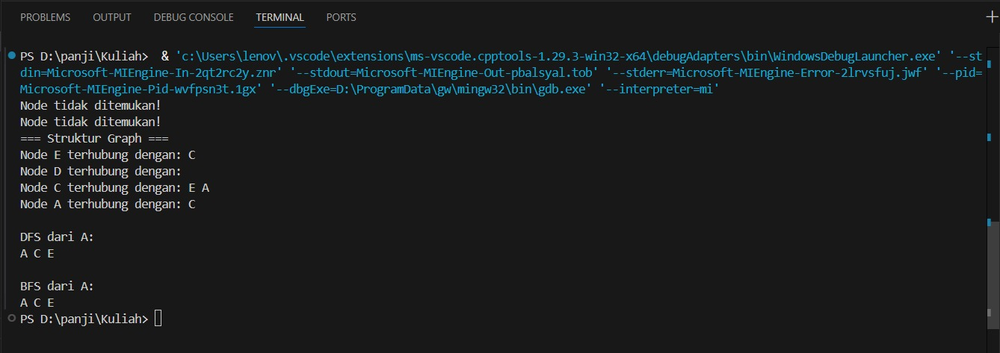
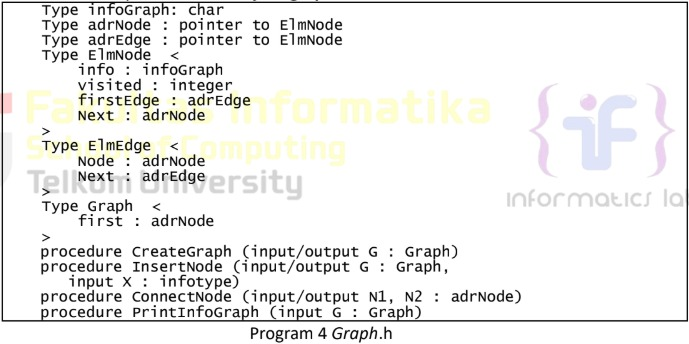
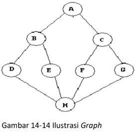
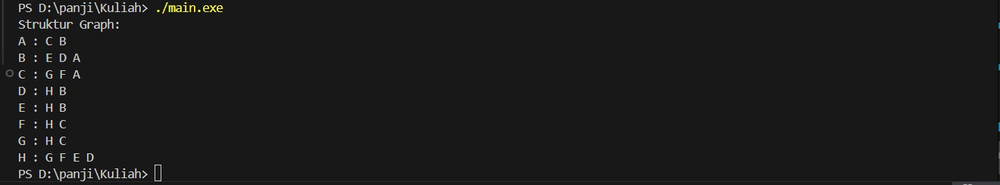

 # <h1 align="center">Laporan Praktikum Modul 14 <br> Graph</h1>
<p align="center">PANJI FAUZAN HABIBULLAH GALANG SOKYA WHIJAYA - 103112430162</p>

## Dasar Teori

Dalam C++, graph (graf) merupakan struktur data non-linear yang dipakai untuk memodelkan hubungan antar berbagai objek. Graph didefinisikan sebagai kumpulan simpul (vertex) dan penghubung antar simpul (edge). Artikel ini menjelaskan cara mengimplementasikan struktur data graph dalam C++.

Implementasi Struktur Data Graph di C++

Ada dua metode utama untuk merepresentasikan atau mengimplementasikan graph di C++:
1. Menggunakan Adjacency Matrix (Matriks Ketetanggaan)

   Adjacency matrix adalah array 2 dimensi berukuran n × n, dengan n adalah jumlah node/simpul pada graph.
   Aturannya:
   - a[i][j] = 1 jika ada edge antara vertex ke-i dan ke-j (vᵢ, vⱼ)
   - a[i][j] = 0 jika tidak ada edge di antara keduanya
   
   Matriks ini digunakan untuk mengetahui apakah ada hubungan (edge) antara dua simpul tertentu.
3. Menggunakan Adjacency List (Daftar Ketetanggaan)

   Pada metode adjacency matrix, graph membutuhkan n² ruang memori, sedangkan adjacency list hadir sebagai solusi yang jauh lebih hemat memori karena hanya menyimpan node yang saling terhubung.
   Adjacency list adalah representasi berbasis node. Pada metode ini, setiap simpul memiliki daftar simpul lain yang bertetangga (terhubung langsung). Biasanya  digunakan array untuk menyimpan daftar tersebut, sehingga akses ke adjacency list dari simpul tertentu dapat dilakukan secara acak (random access).

## Guided

### soal 1
guided 1.cpp

```go
#include <iostream>
#include <queue>
using namespace std;

typedef char infotype;

struct Edge;
struct Node;

typedef Node* adrNode;
typedef Edge* adrEdge;

struct Edge {
    adrNode tujuan;
    adrEdge next;
};

struct Node {
    infotype info;
    bool visited;
    adrEdge firstEdge;
    adrNode next;
};

struct Graph {
    adrNode first;
};

void CreateGraph(Graph &G) {
    G.first = NULL;
}

adrNode alokasiNode(infotype X) {
    adrNode P = new Node;
    P->info = X;
    P->visited = false;
    P->firstEdge = NULL;
    P->next = NULL;
    return P;
}

adrEdge alokasiEdge(adrNode tujuan) {
    adrEdge P = new Edge;
    P->tujuan = tujuan;
    P->next = NULL;
    return P;
}

void InsertNode(Graph &G, infotype X) {
    adrNode P = alokasiNode(X);
    P->next = G.first;
    G.first = P;
}

adrNode FindNode(Graph G, infotype X) {
    adrNode P = G.first;
    while (P != NULL) {
        if (P->info == X)
            return P;
        P = P->next;
    }
    return NULL;
}

void ConnectNode(Graph &G, infotype A, infotype B) {
    adrNode N1 = FindNode(G, A);
    adrNode N2 = FindNode(G, B);

    if (N1 == NULL || N2 == NULL) {
        cout << "Node tidak ditemukan!\n";
        return;
    }

    adrEdge E1 = alokasiEdge(N2);
    E1->next = N1->firstEdge;
    N1->firstEdge = E1;

    adrEdge E2 = alokasiEdge(N1);
    E2->next = N2->firstEdge;
    N2->firstEdge = E2;
}

void PrintInfoGraph(Graph G) {
    adrNode P = G.first;
    while (P != NULL) {
        cout << "Node " << P->info << " terhubung dengan: ";
        adrEdge E = P->firstEdge;
        while (E != NULL) {
            cout << E->tujuan->info << " ";
            E = E->next;
        }
        cout << endl;
        P = P->next;
    }
}

void ResetVisited(Graph &G) {
    adrNode P = G.first;
    while (P != NULL) {
        P->visited = false;
        P = P->next;
    }
}

void DFS(Graph &G, adrNode N) {
    if (N == NULL) return;
    N->visited = true;
    cout << N->info << " ";

    adrEdge E = N->firstEdge;
    while (E != NULL) {
        if (!E->tujuan->visited)
            DFS(G, E->tujuan);
        E = E->next;
    }
}

void BFS(Graph &G, adrNode N) {
    if (N == NULL) return;
    queue<adrNode> Q;
    Q.push(N);

    while (!Q.empty()) {
        adrNode curr = Q.front();
        Q.pop();

        if (!curr->visited) {
            curr->visited = true;
            cout << curr->info << " ";

            adrEdge E = curr->firstEdge;
            while (E != NULL) {
                if (!E->tujuan->visited)
                    Q.push(E->tujuan);
                E = E->next;
            }
        }
    }
}

int main() {
    Graph G;
    CreateGraph(G);

    InsertNode(G, 'A');
    InsertNode(G, 'C');
    InsertNode(G, 'D');
    InsertNode(G, 'E');

    ConnectNode(G, 'A', 'B');
    ConnectNode(G, 'A', 'C');
    ConnectNode(G, 'B', 'D');
    ConnectNode(G, 'C', 'E');

    cout << "=== Struktur Graph ===\n";
    PrintInfoGraph(G);

    cout << "\nDFS dari A:\n";
    ResetVisited(G);
    DFS(G, FindNode(G, 'A'));

    cout << "\n\nBFS dari A:\n";
    ResetVisited(G);
    BFS(G, FindNode(G, 'A'));

    cout << endl;
    return 0;
}
```

> Output
> 

Program ini membuat struktur graph tak berarah dengan model adjacency list menggunakan linked list. Setiap node menyimpan nilai char, status visited, dan daftar edge (tetangga) yang terhubung ke node lain. Koneksi dibuat dua arah sehingga hubungan bersifat undirected. Terdapat traversal DFS yang berjalan rekursif menelusuri kedalaman node, dan BFS yang menggunakan queue untuk menelusuri node per level secara melebar. Status visited dipakai agar node tidak dikunjungi lebih dari sekali. Pada fungsi main(), graph diinisialisasi, node ditambahkan, hubungan antar node dibuat, lalu struktur graph ditampilkan dan traversal dimulai dari node A.

## Unguided

### Soal 1

Buatlah ADT Graph tidak berarah file “graph.h”:
> 

Buatlah implementasi ADT Graph pada file “graph.cpp” dan cobalah hasil implementasi ADT
pada file “main.cpp”.
> 

graph.cpp, graph.h, dan main.cpp
```go
#include "graph.h"
#include <iostream>
using namespace std;

void CreateGraph(Graph &G) {
    G.first = NULL;
}

adrNode alokasiNode(infograph X) {
    adrNode P = new ElmNode;
    P->info = X;
    P->visited = 0;
    P->firstEdge = NULL;
    P->next = NULL;
    return P;
}

adrEdge alokasiEdge(adrNode tujuan) {
    adrEdge P = new ElmEdge;
    P->tujuan = tujuan;
    P->next = NULL;
    return P;
}

void InsertNode(Graph &G, infograph X) {
    adrNode P = alokasiNode(X);
    P->next = G.first;
    G.first = P;
}

adrNode FindNode(Graph G, infograph X) {
    adrNode P = G.first;
    while (P != NULL) {
        if (P->info == X)
            return P;
        P = P->next;
    }
    return NULL;
}

void ConnectNode(Graph &G, infograph A, infograph B) {
    adrNode N1 = FindNode(G, A);
    adrNode N2 = FindNode(G, B);

    if (N1 == NULL || N2 == NULL) {
        cout << "Node tidak ditemukan!\n";
        return;
    }

    adrEdge E1 = alokasiEdge(N2);
    E1->next = N1->firstEdge;
    N1->firstEdge = E1;

    adrEdge E2 = alokasiEdge(N1);
    E2->next = N2->firstEdge;
    N2->firstEdge = E2;
}

void PrintInfoGraph(Graph G) {
    adrNode P = G.first;
    while (P != NULL) {
        cout << P->info << " : ";
        adrEdge E = P->firstEdge;
        while (E != NULL) {
            cout << E->tujuan->info << " ";
            E = E->next;
        }
        cout << endl;
        P = P->next;
    }
}
```
```go
#ifndef GRAPH_H
#define GRAPH_H

typedef char infograph;
struct ElmNode;
struct ElmEdge;

typedef ElmNode* adrNode;
typedef ElmEdge* adrEdge;

struct ElmNode {
    infograph info;
    int visited;
    adrEdge firstEdge;
    adrNode next;
};

struct ElmEdge {
    adrNode tujuan;
    adrEdge next;
};

struct Graph {
    adrNode first;
};

void CreateGraph(Graph &G);
void InsertNode(Graph &G, infograph X);
void ConnectNode(Graph &G, infograph A, infograph B);
void PrintInfoGraph(Graph G);

#endif
```
```go
#include <iostream>
#include "graph.h"
using namespace std;

int main() {
    Graph G;
    CreateGraph(G);

    InsertNode(G, 'H');
    InsertNode(G, 'G');
    InsertNode(G, 'F');
    InsertNode(G, 'E');
    InsertNode(G, 'D');
    InsertNode(G, 'C');
    InsertNode(G, 'B');
    InsertNode(G, 'A');

    ConnectNode(G, 'A', 'B');
    ConnectNode(G, 'A', 'C');
    ConnectNode(G, 'B', 'D');
    ConnectNode(G, 'B', 'E');
    ConnectNode(G, 'C', 'F');
    ConnectNode(G, 'C', 'G');
    ConnectNode(G, 'D', 'H');
    ConnectNode(G, 'E', 'H');
    ConnectNode(G, 'F', 'H');
    ConnectNode(G, 'G', 'H');

    cout << "Struktur Graph:\n";
    PrintInfoGraph(G);

    return 0;
}
```

> Output
> 

Program tersebut adalah implementasi Graph tak berarah (Undirected Graph) dengan Adjacency List memakai linked list. Node disimpan dalam list induk, sedangkan edge disimpan dalam list tetangga tiap node. Insert node dilakukan di awal list, dan koneksi antar node dibuat dua arah. Print menampilkan hubungan tiap node dengan tetangganya (DFS/BFS tidak dipanggil di main).

### Soal 2

Buatlah prosedur untuk menampilkanhasil penelusuran DFS.

prosedur PrintDFS (Graph G, adrNode N);

```go
#include <iostream>
using namespace std;

string angkaKeTulisan(int n)
{
    string satuan[] = {"", "Satu", "Dua", "Tiga", "Empat", "Lima",
                       "Enam", "Tujuh", "Delapan", "Sembilan"};

    if (n == 0)
        return "Nol";
    else if (n == 10)
        return "Sepuluh";
    else if (n == 11)
        return "Sebelas";
    else if (n == 100)
        return "Seratus";
    else if (n < 10)
        return satuan[n];
    else if (n < 20)
    {
        int belas = n%10;
        string hasil = satuan[belas] + " Belas";
        return hasil;
    }
    else
    {
        int puluh = n / 10;
        int sisa = n % 10;
        string hasil = satuan[puluh] + " Puluh";
        if (sisa > 0)
            hasil += " " + satuan[sisa];
        return hasil;
    }
}

int main()
{
    int angka;
    cout << "Masukkan angka (0-100): ";
    cin >> angka;

    if (angka < 0 || angka > 100)
    {
        cout << "Angka di luar jangkauan!" << endl;
    }
    else
    {
        cout << angka << ": " << angkaKeTulisan(angka) << endl;
    }

    return 0;
}
```

> Output
> 

Program di atas menambahkan fungsi PrintDFS untuk menelusuri graph dengan algoritma Depth-First Search (DFS). Fungsi ini memakai rekursi, menandai node sebagai visited, lalu mencetak info node tersebut. Setelah itu, program mengecek semua edge yang terhubung dan memanggil dirinya kembali ke node tujuan yang belum dikunjungi. Output yang dihasilkan adalah urutan kunjungan node mulai dari titik awal hingga semua jalur terdalam selesai dieksplorasi.

### Soal 3

Buatlah prosedur untuk menampilkanhasil penelusuran DFS.

prosedur PrintBFS (Graph G, adrNode N);

```go
#include <iostream>
using namespace std;

int main() {
    int n;
    cout << "Input: ";
    cin >> n;
    cout << "Output: "<<endl;

    for (int i = n; i >= 1; i--) {

        for (int s = 0; s < (n - i); s++) {
            cout << "  ";
        }
        for (int j = i; j >= 1; j--) {
            cout << j << " ";
        }
        cout << "* ";
        for (int j = 1; j <= i; j++) {
            cout << j << " ";
        }
        cout << endl;
    }

    for (int s = 0; s < n; s++) {
        cout << "  ";
    }
    cout << "*" << endl;

    return 0;
}
```

> Output
> 

Program PrintBFS melakukan penelusuran graph dengan algoritma Breadth-First Search. Node awal dimasukkan ke queue, lalu diproses satu per satu. Jika node belum dikunjungi, program menandainya visited dan mencetak nilainya, kemudian semua tetangganya dimasukkan ke queue. Hasilnya adalah urutan kunjungan graph secara melebar(per level).

## Referensi

1. https://en.wikipedia.org/wiki/Data_structure (diakses blablabla)
2. https://www.geeksforgeeks.org/cpp/implementation-of-graph-in-cpp/
3. https://takeuforward.org/graph/graph-representation-in-c
